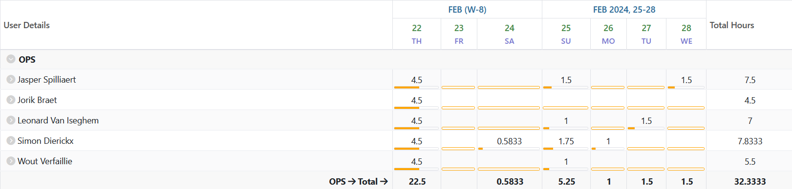
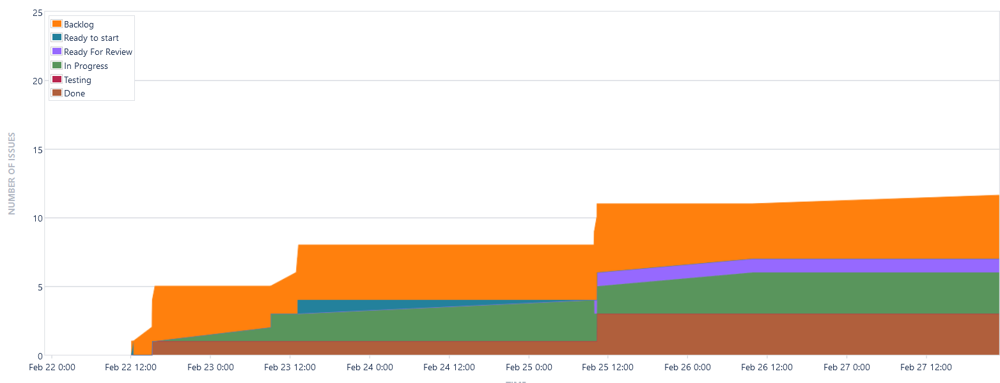
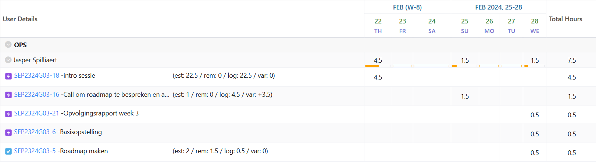
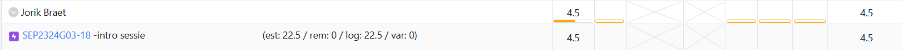
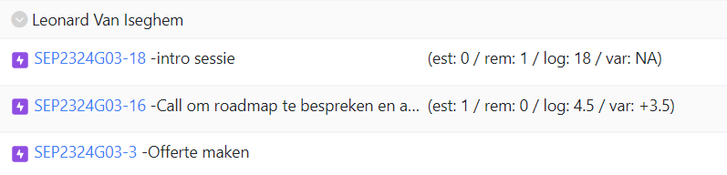
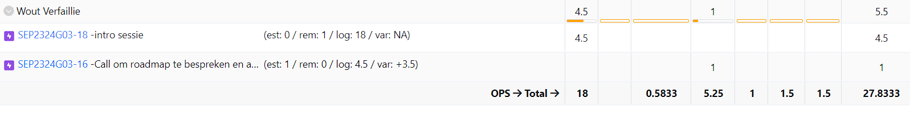
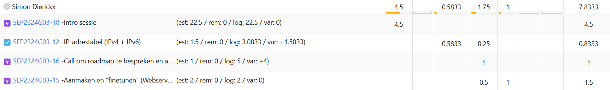

# Opvolgingsrapport 1

## Algemeen

- Groep: G03
- Periode: 22/02/2024 tot 28/02/2024
- Datum voortgangsgesprek: 29/02/2024

| Student             | Afw. | Opmerking |
| :------------------ | :--: | :-------- |
| Jasper Spilliaert   |      |           |
| Jorik Braet         |      |           |
| Leonard Van Iseghem |      |           |
| Wout Verfaillie     |      |           |
| Simon Dierickx      |      |           |

## Wat heb je deze periode gerealiseerd?

### Algemeen

- Github repo opgezet
- Jira omgeving opgezet
- IP-adrestabel gemaakt
- Offerte
- Roadmap aangevuld

#### KanBan

<!-- Voeg hier een screenshot toe van de huidige toestand van het kanban bord. -->

Geen toestand deze periode

#### Tijdsregistratie

<!-- Voeg hier een screenshot toe van het teamoverzicht van de tijdregistratie, met totaal per student en team -->

#### Cumulatief flow diagram

<!-- Voeg hier een screenshot toe van het cumulatief flow diagram voor de periode van het rapport. -->
Cumulative Flow Diagram (periode)

<!-- Voeg hier een screenshot toe van het cumulatief flow diagram voor de volledige periode van het project. -->

<!--  (NIET NODIG VOOR WEEK 1)--> 

### Jasper Spilliaert

<!-- Voeg hier een overzicht toe van gerealiseerde taken inclusief links naar relevante commits/documenten. -->

- Opzetten Github repo (Inital commit)
- Opzetten Jira omgeving
- Roadmap aangevuld
- Besproken Offerte + kleine uitwerking (03109ce)
- Bekabeling PKT (625e547)
- Gekeken voor werking TFTP - running-config files, maken PKT 10.6.10 (5949c1c)

<!-- Voeg hier een screenshot van het individueel tijdregistratierapport, met overzicht van elke taak en bijhorende uren. -->

### Jorik Braet

<!-- Voeg hier een overzicht toe van gerealiseerde taken inclusief links naar relevante commits/documenten. -->

- Bespreking offerte
- Opzoekwerk tfpt server + nginx reverse proxy
- Jira omgeving verkennen
- call roadmap

<!-- Voeg hier een screenshot van het individueel tijdregistratierapport, met overzicht van elke taak en bijhorende uren. -->
 

### Leonard Van Iseghem

<!-- Voeg hier een overzicht toe van gerealiseerde taken inclusief links naar relevante commits/documenten. -->

- Opzoeken requirements van de services die we moeten opzetten
- Apparaten opzoeken die voldoen aan de requirements

<!-- Voeg hier een screenshot van het individueel tijdregistratierapport, met overzicht van elke taak en bijhorende uren. -->

### Wout Verfaillie

- Github repo opgezet
- Jira omgeving klaargezet
- Roadmap aangevuld
- Besproken Offerte
- <!-- Voeg hier een overzicht toe van gerealiseerde taken inclusief links naar relevante commits/documenten. -->

### Simon Dierickx

<!-- Voeg hier een overzicht toe van gerealiseerde taken inclusief links naar relevante commits/documenten. -->

- Github repo opgezet
- Jira omgeving klaargezet
- Roadmap aangevuld
- Besproken Offerte
- Opzetten 2 VM's (Web en DB)
- Netwerktabel

<!-- Voeg hier een screenshot van het individueel tijdregistratierapport, met overzicht van elke taak en bijhorende uren. -->

## Wat plan je volgende periode te doen?

### Algemeen

<!-- Voeg hier de doelstellingen toe voor volgende periode. -->

- Offerte afwerken
- ...

### Jasper Spilliaert

<!-- Voeg hier de individuele doelstellingen toe voor volgende periode. -->

- Werken aan de offerte & presentatie
- Windows DC automatiseren

### Jorik Braet

<!-- Voeg hier de individuele doelstellingen toe voor volgende periode. -->

- Offerte afwerken
- Opstellen tftp server en nginx reverse proxy

### Leonard Van Iseghem

<!-- Voeg hier de individuele doelstellingen toe voor volgende periode. -->
- Verder opzoekwerk voor de offerte, zorgen dat we concurrentiele prijzen hebben

### Wout Verfaillie

<!-- Voeg hier de individuele doelstellingen toe voor volgende periode. -->

- Offerte afwerken
- Netwerk bekijken

### Simon Dierickx

<!-- Voeg hier de individuele doelstellingen toe voor volgende periode. -->

- ...

## Retrospectieve

### Wat doen jullie goed?

<!-- Voeg hier zaken toe die jullie goed doen naar het proces toe. -->

- We heben deze eerste week al direct als een team samengewerkt

### Waar hebben jullie nog problemen mee?

<!-- Voeg hier zaken toe die volgens jullie beter kunnen naar het proces toe. -->

- afspreken wie wat doet

### Feedback

#### Groep

#### Student 1

#### Student 2

#### Student 3

#### Student 4

#### Student 5
