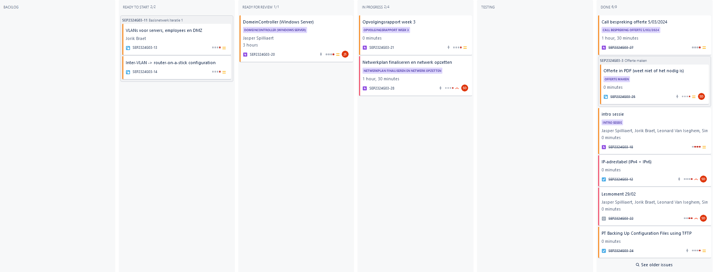
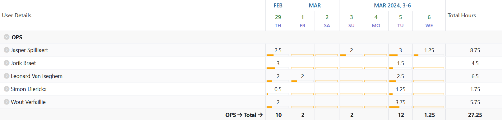
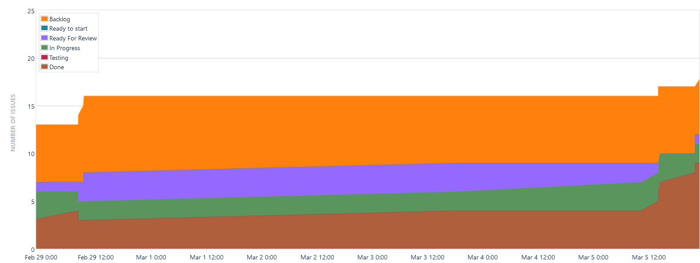
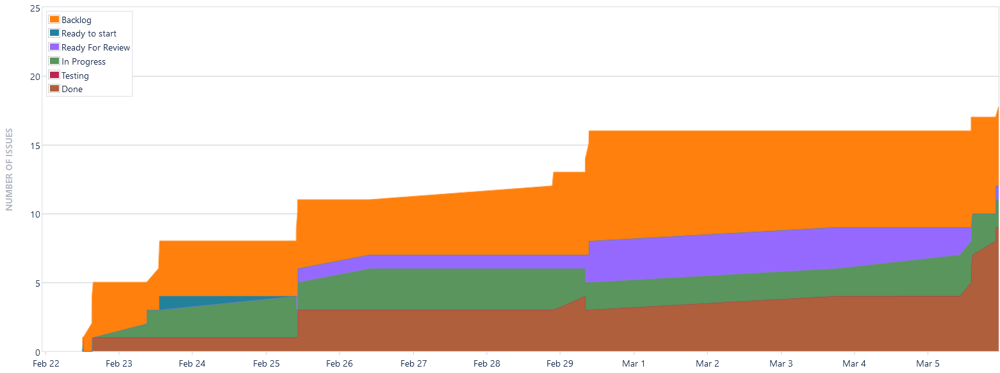
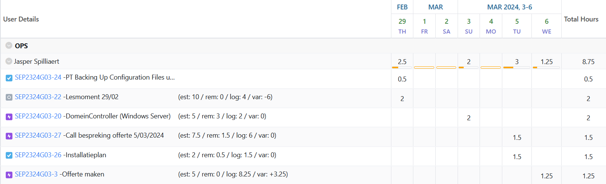
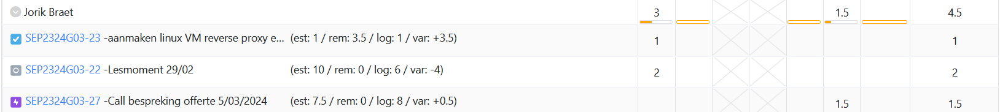
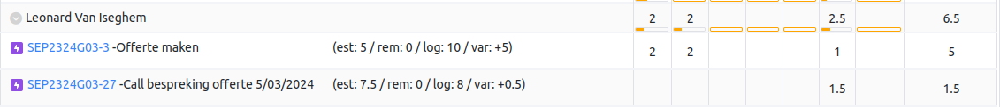
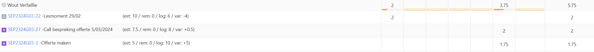

# Opvolgingsrapport 2

## Algemeen

- Groep: G03
- Periode: 29/02/2024 tot 06/03/2024
- Datum voortgangsgesprek: 07/03/2024

| Student             | Afw. | Opmerking |
| :------------------ | :--: | :-------- |
| Jasper Spilliaert   |      |           |
| Jorik Braet         |      |           |
| Leonard Van Iseghem |      |           |
| Wout Verfaillie     |      |           |
| Simon Dierickx      |      |           |

## Wat heb je deze periode gerealiseerd?

### Algemeen

- Offerte afgewerkt + presentatie
- Windows DC geautomatiseerd
- Nginx & tftp VM's aangemaakt voor Linux
- IP-adrestabel volledig afgewerkt

#### KanBan

<!-- Voeg hier een screenshot toe van de huidige toestand van het kanban bord. -->

#### Tijdsregistratie

<!-- Voeg hier een screenshot toe van het teamoverzicht van de tijdregistratie, met totaal per student en team -->

#### Cumulatief flow diagram

<!-- Voeg hier een screenshot toe van het cumulatief flow diagram voor de periode van het rapport. -->

Cumulative Flow Diagram (periode)

<!-- Voeg hier een screenshot toe van het cumulatief flow diagram voor de volledige periode van het project. -->

Cumulative Flow Diagram (volledig project)

### Jasper Spilliaert

<!-- Voeg hier een overzicht toe van gerealiseerde taken inclusief links naar relevante commits/documenten. -->

- DomeinController Windows Server geautomatiseerd (16aa902)
- Installatieplan aangevuld van offerte (be77b21 & 6164abe)
- Presentatie offerte afgewerkt (6afa42a)

<!-- Voeg hier een screenshot van het individueel tijdregistratierapport, met overzicht van elke taak en bijhorende uren. -->

### Jorik Braet

<!-- Voeg hier een overzicht toe van gerealiseerde taken inclusief links naar relevante commits/documenten. -->

- Aanmaken van tftp vm en nginx vm
- Call bespreking offerte
- Presentatie offerte afgewerkt

<!-- Voeg hier een screenshot van het individueel tijdregistratierapport, met overzicht van elke taak en bijhorende uren. -->

### Leonard Van Iseghem

<!-- Voeg hier een overzicht toe van gerealiseerde taken inclusief links naar relevante commits/documenten. -->

- Verder zoeken naar de juiste apparaten en hun prijzen
- Loon van IT'er opzoeken en schatting maken v/e aantal uren

<!-- Voeg hier een screenshot van het individueel tijdregistratierapport, met overzicht van elke taak en bijhorende uren. -->

### Wout Verfaillie

<!-- Voeg hier een overzicht toe van gerealiseerde taken inclusief links naar relevante commits/documenten. -->

- Presentatie offerte afgewerkt (6f62a0d)
- Installatieplan aangevuld van offerte 

### Simon Dierickx

<!-- Voeg hier een overzicht toe van gerealiseerde taken inclusief links naar relevante commits/documenten. -->

- Offerte verder uitwerken
- Basis netwerk uitwerken (IPv4 en volledige setup)

<!-- Voeg hier een screenshot van het individueel tijdregistratierapport, met overzicht van elke taak en bijhorende uren. -->

## Wat plan je volgende periode te doen?

### Algemeen

<!-- Voeg hier de doelstellingen toe voor volgende periode. -->

- Proberen volledig afwerken Basisopdracht

### Jasper Spilliaert

<!-- Voeg hier de individuele doelstellingen toe voor volgende periode. -->

- Werken aan Windows gedeelte

### Jorik Braet

<!-- Voeg hier de individuele doelstellingen toe voor volgende periode. -->

- Werken aan configuratie van reverse proxy 

### Leonard Van Iseghem

- Werken aan de configuratie van het netwerk
<!-- Voeg hier de individuele doelstellingen toe voor volgende periode. -->

### Wout Verfaillie

<!-- Voeg hier de individuele doelstellingen toe voor volgende periode. -->

- ...

### Simon Dierickx

<!-- Voeg hier de individuele doelstellingen toe voor volgende periode. -->

- Netwerk verder afwerken

## Retrospectieve

### Wat doen jullie goed?

<!-- Voeg hier zaken toe die jullie goed doen naar het proces toe. -->

- We hebben het werk goed verdeeld

### Waar hebben jullie nog problemen mee?

<!-- Voeg hier zaken toe die volgens jullie beter kunnen naar het proces toe. -->

- onduidelijkheden bevragen bij lectoren

### Feedback

#### Groep

#### Student 1

#### Student 2

#### Student 3

#### Student 4

#### Student 5
