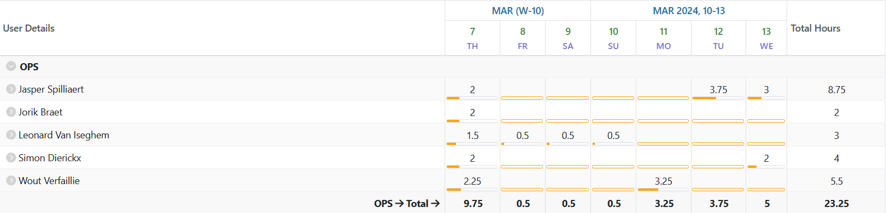
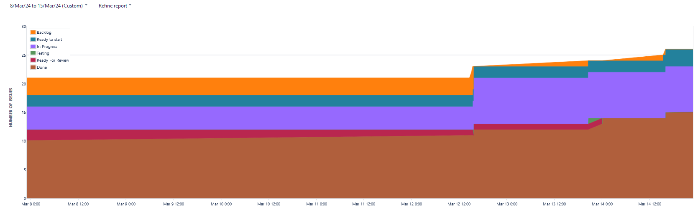
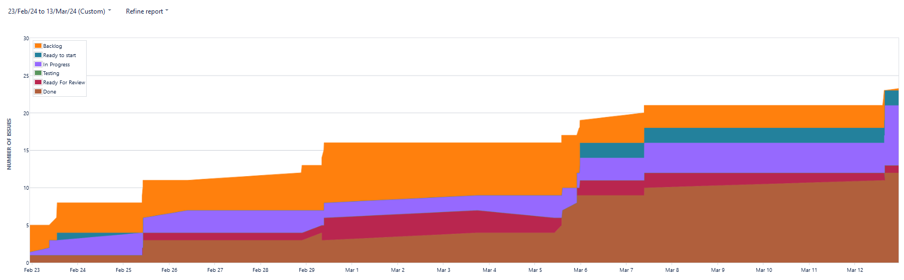
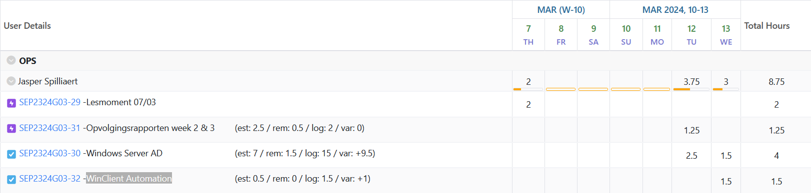
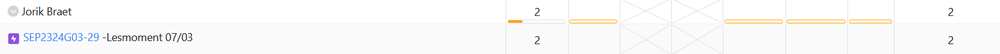
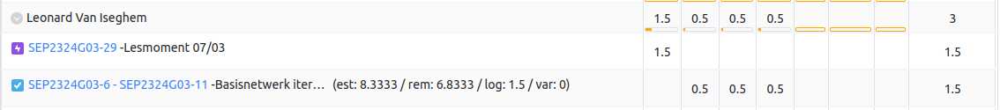
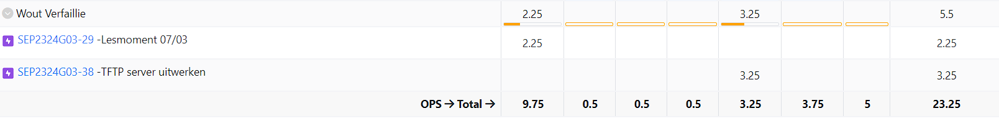
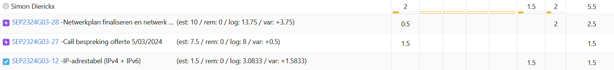

# Opvolgingsrapport 3

## Algemeen

- Groep: G03
- Periode: 7/03/2024 tot 13/03/2024
- Datum voortgangsgesprek: 14/03/2024

| Student             | Afw. | Opmerking |
| :------------------ | :--: | :-------- |
| Jasper Spilliaert   |      |           |
| Jorik Braet         |      |           |
| Leonard Van Iseghem |      |           |
| Wout Verfaillie     |      |           |
| Simon Dierickx      |      |           |

## Wat heb je deze periode gerealiseerd?

### Algemeen

- Windows automatie verder uitgebreid, WinClient automatie
- tftp server verder uitgebreid
- IP-adrestabel aanpassingen
- Netwerk verder uitbereiden

#### KanBan

<!-- Voeg hier een screenshot toe van de huidige toestand van het kanban bord. -->

Geen toestand deze periode

#### Tijdsregistratie

<!-- Voeg hier een screenshot toe van het teamoverzicht van de tijdregistratie, met totaal per student en team -->

#### Cumulatief flow diagram

<!-- Voeg hier een screenshot toe van het cumulatief flow diagram voor de periode van het rapport. -->
Cumulative Flow Diagram (periode)

<!-- Voeg hier een screenshot toe van het cumulatief flow diagram voor de volledige periode van het project. -->
Cumulative Flow Diagram (volledig project)

### Jasper Spilliaert

<!-- Voeg hier een overzicht toe van gerealiseerde taken inclusief links naar relevante commits/documenten. -->

- WinClient automation script  (e2b68cb)
- Gewerkt aan automatie AD config + netwerkconfig Windows VM's (f6aba28)
- Presentatie offerte gedaan

<!-- Voeg hier een screenshot van het individueel tijdregistratierapport, met overzicht van elke taak en bijhorende uren. -->

### Jorik Braet

<!-- Voeg hier een overzicht toe van gerealiseerde taken inclusief links naar relevante commits/documenten. -->

- Presentatie offerte

<!-- Voeg hier een screenshot van het individueel tijdregistratierapport, met overzicht van elke taak en bijhorende uren. -->

### Leonard Van Iseghem

<!-- Voeg hier een overzicht toe van gerealiseerde taken inclusief links naar relevante commits/documenten. -->

- Presentatie offerte gedaan
- Gewerkt aan configuratie Switch 1

<!-- Voeg hier een screenshot van het individueel tijdregistratierapport, met overzicht van elke taak en bijhorende uren. -->

### Wout Verfaillie

<!-- Voeg hier een overzicht toe van gerealiseerde taken inclusief links naar relevante commits/documenten. -->

- Presentatie offerte gedaan
- gewerkt aan tftp server

### Simon Dierickx

<!-- Voeg hier een overzicht toe van gerealiseerde taken inclusief links naar relevante commits/documenten. -->

- Presentatie offerte
- IPv4 configuratie verder afwerken, HSRP beginnen integreren

<!-- Voeg hier een screenshot van het individueel tijdregistratierapport, met overzicht van elke taak en bijhorende uren. -->

## Wat plan je volgende periode te doen?

### Algemeen

<!-- Voeg hier de doelstellingen toe voor volgende periode. -->

### Jasper Spilliaert

<!-- Voeg hier de individuele doelstellingen toe voor volgende periode. -->

- Proberen Windows gedeelte volledig af te werken
- evt. kijken voor Linux / Netwerken

### Jorik Braet

<!-- Voeg hier de individuele doelstellingen toe voor volgende periode. -->

- configuratie van reverse proxy afwerken 
- helpen waar nodig bij windows server

### Leonard Van Iseghem

<!-- Voeg hier de individuele doelstellingen toe voor volgende periode. -->

- Verder werken aan netwerk, router on a stick zeker doen werken

### Wout Verfaillie

<!-- Voeg hier de individuele doelstellingen toe voor volgende periode. -->

- proberen om tftp server af te werken

### Simon Dierickx

<!-- Voeg hier de individuele doelstellingen toe voor volgende periode. -->

- Netwerk zo snel mogelijk afwerken

## Retrospectieve

### Wat doen jullie goed?

<!-- Voeg hier zaken toe die jullie goed doen naar het proces toe. -->

- tijdens de contactmomenten werken we altijd geconcentreerd samen
- iedereen heeft de zelfde motivatie om het project tot een goed einde te brengen

### Waar hebben jullie nog problemen mee?

<!-- Voeg hier zaken toe die volgens jullie beter kunnen naar het proces toe. -->

/

### Feedback

#### Groep

#### Student 1

#### Student 2

#### Student 3

#### Student 4

#### Student 5
