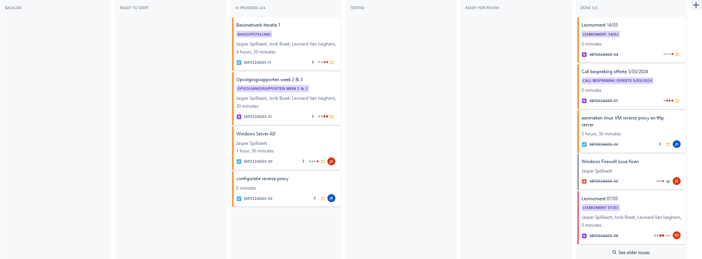
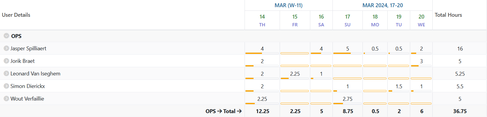
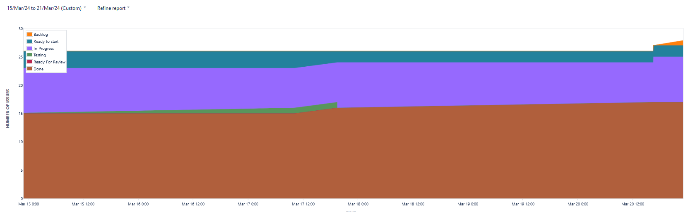
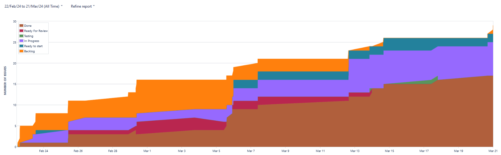
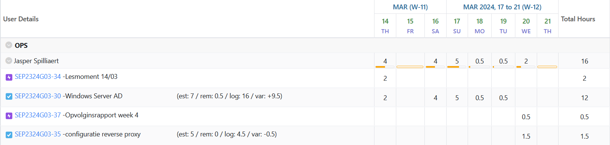
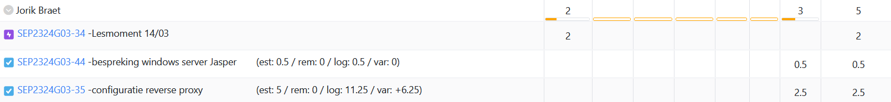
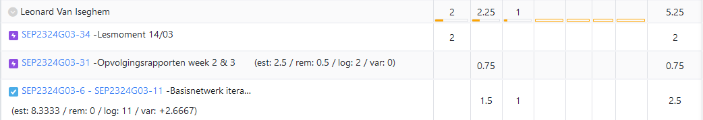
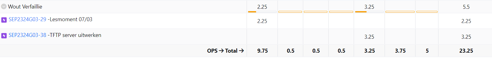
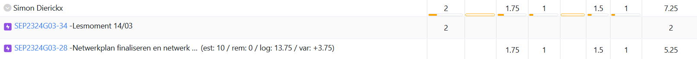

# Opvolgingsrapport 4

## Algemeen

- Groep: G03
- Periode: 14/03/2024 tot 20/03/2024
- Datum voortgangsgesprek: 21/03/2024

| Student             | Afw. | Opmerking |
| :------------------ | :--: | :-------- |
| Jasper Spilliaert   |      |           |
| Jorik Braet         |      |           |
| Leonard Van Iseghem |      |           |
| Wout Verfaillie     |      |           |
| Simon Dierickx      |      |           |

## Wat heb je deze periode gerealiseerd?

### Algemeen

- Windows automatisatie verder gezet
- Reverse proxy, Tftp verder uitwerken
- Netwerkplan finaliseren

#### KanBan

<!-- Voeg hier een screenshot toe van de huidige toestand van het kanban bord. -->

#### Tijdsregistratie

<!-- Voeg hier een screenshot toe van het teamoverzicht van de tijdregistratie, met totaal per student en team -->

#### Cumulatief flow diagram

<!-- Voeg hier een screenshot toe van het cumulatief flow diagram voor de periode van het rapport. -->
Cumulative Flow Diagram (periode)

<!-- Voeg hier een screenshot toe van het cumulatief flow diagram voor de volledige periode van het project. -->
Cumulative Flow Diagram (volledig project)

### Jasper Spilliaert

<!-- Voeg hier een overzicht toe van gerealiseerde taken inclusief links naar relevante commits/documenten. -->

- Windows automatie verder uitgebreid, maar nog niet klaar (8675ea4, a91d7aa)
- Gewerkt aan reverseproxy Linux (f95370c, 03d56a9)
- Opvolgingsrapport 4 (b2687c3)

<!-- Voeg hier een screenshot van het individueel tijdregistratierapport, met overzicht van elke taak en bijhorende uren. -->

### Jorik Braet

<!-- Voeg hier een overzicht toe van gerealiseerde taken inclusief links naar relevante commits/documenten. -->

- configuratie van reverse proxy
- bespreking met Jasper over windows server 

<!-- Voeg hier een screenshot van het individueel tijdregistratierapport, met overzicht van elke taak en bijhorende uren. -->

### Leonard Van Iseghem

<!-- Voeg hier een overzicht toe van gerealiseerde taken inclusief links naar relevante commits/documenten. -->
- Werken aan het netwerk, specifiek het troubleshooten van de router-on-a-stick opstelling, en troubleshooten van het HSRP probleem
<!-- Voeg hier een screenshot van het individueel tijdregistratierapport, met overzicht van elke taak en bijhorende uren. -->

### Wout Verfaillie

<!-- Voeg hier een overzicht toe van gerealiseerde taken inclusief links naar relevante commits/documenten. -->

- gewerkt aan TFTP server

### Simon Dierickx

<!-- Voeg hier een overzicht toe van gerealiseerde taken inclusief links naar relevante commits/documenten. -->

- Voorbereiding basisopstelling voor Netwerken, troubleshooten

<!-- Voeg hier een screenshot van het individueel tijdregistratierapport, met overzicht van elke taak en bijhorende uren. -->

## Wat plan je volgende periode te doen?

### Algemeen

<!-- Voeg hier de doelstellingen toe voor volgende periode. -->

- Basis volledig afgewerkt
- Tesplannen, tesrapporten & lastenboek aanvullen

### Jasper Spilliaert

<!-- Voeg hier de individuele doelstellingen toe voor volgende periode. -->

- Windows volledig afwerken tegen zaterdag
- Tesplannen, Tesrapporten & lastenboek opstellen 
- Analyse volledig uitvoeren
- Helpen waar nodig (Linux / Netwerken) zodat alles afgewerk is tegen donderdag

### Jorik Braet

<!-- Voeg hier de individuele doelstellingen toe voor volgende periode. -->

- volledig afwerken van reverse proxy

### Leonard Van Iseghem

<!-- Voeg hier de individuele doelstellingen toe voor volgende periode. -->

- Netwerk basisopstelling finaliseren
- Fysieke opstelling netwerk testen

### Wout Verfaillie

<!-- Voeg hier de individuele doelstellingen toe voor volgende periode. -->

- TFTP volledig afhalen
- testplannen, lastenboek en testrapporten opstellen
- Analyse uitwerken

### Simon Dierickx

<!-- Voeg hier de individuele doelstellingen toe voor volgende periode. -->

- Laatste aanpassingen doorvoeren om opstelling volledig te maken

## Retrospectieve

### Wat doen jullie goed?

<!-- Voeg hier zaken toe die jullie goed doen naar het proces toe. -->

### Waar hebben jullie nog problemen mee?

<!-- Voeg hier zaken toe die volgens jullie beter kunnen naar het proces toe. -->

- we kunnen wat beter onze uren loggen

### Feedback

#### Groep

#### Student 1

#### Student 2

#### Student 3

#### Student 4

#### Student 5
