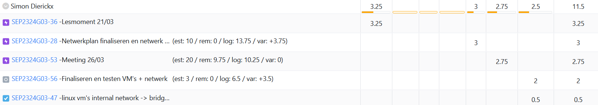

# Opvolgingsrapport 5

## Algemeen

- Groep: G03
- Periode: 21/03/2024 tot 27/03/2024
- Datum voortgangsgesprek: 28/03/2024

| Student             | Afw. | Opmerking |
| :------------------ | :--: | :-------- |
| Jasper Spilliaert   |      |           |
| Jorik Braet         |      |           |
| Leonard Van Iseghem |      |           |
| Wout Verfaillie     |      |           |
| Simon Dierickx      |      |           |

## Wat heb je deze periode gerealiseerd?

### Algemeen

- Alles afgewerkt voor basisopstelling 28/03/2024

#### KanBan

<!-- Voeg hier een screenshot toe van de huidige toestand van het kanban bord. -->

#### Tijdsregistratie

<!-- Voeg hier een screenshot toe van het teamoverzicht van de tijdregistratie, met totaal per student en team -->

#### Cumulatief flow diagram

<!-- Voeg hier een screenshot toe van het cumulatief flow diagram voor de periode van het rapport. -->
Cumulative Flow Diagram (periode)

<!-- Voeg hier een screenshot toe van het cumulatief flow diagram voor de volledige periode van het project. -->
Cumulative Flow Diagram (volledig project)

### Jasper Spilliaert

<!-- Voeg hier een overzicht toe van gerealiseerde taken inclusief links naar relevante commits/documenten. -->

- Volledige Windows Server / Client configuratie werkend (dns, Domainstructure, shared folder, GPO) (d204f75, b3b5b32, 3c9f16f, 279bb34)
- Testplannen & Testrapporten Windows Server en Windows Client aangemaakt (3c9f16f)

<!-- Voeg hier een screenshot van het individueel tijdregistratierapport, met overzicht van elke taak en bijhorende uren. -->

### Jorik Braet

<!-- Voeg hier een overzicht toe van gerealiseerde taken inclusief links naar relevante commits/documenten. -->

- testplan testrapport 
- intern network naar bridged
- testen van volledige basis opstelling

<!-- Voeg hier een screenshot van het individueel tijdregistratierapport, met overzicht van elke taak en bijhorende uren. -->

### Leonard Van Iseghem

<!-- Voeg hier een overzicht toe van gerealiseerde taken inclusief links naar relevante commits/documenten. -->

- Netwerk opstelling fysiek getest
- Bellen op zondag voor planning
- Netwerk opstelling zonder HSRP maken in PT
- Dinsdag troubleshooten voor toonmoment
- Windows Client opzetten voor toonmoment
<!-- Voeg hier een screenshot van het individueel tijdregistratierapport, met overzicht van elke taak en bijhorende uren. -->

### Wout Verfaillie

<!-- Voeg hier een overzicht toe van gerealiseerde taken inclusief links naar relevante commits/documenten. -->

- Bellen op zondag voor planning
- Dinsdag troubleshooten voor toonmoment
- TFTP server opgezet voor basisopstelling demo

### Simon Dierickx

<!-- Voeg hier een overzicht toe van gerealiseerde taken inclusief links naar relevante commits/documenten. -->

- Netwerk opstelling fysiek getest
- Bellen op zondag voor planning
- Netwerk opstelling zonder HSRP maken in PT
- Dinsdag troubleshooten voor toonmoment

<!-- Voeg hier een screenshot van het individueel tijdregistratierapport, met overzicht van elke taak en bijhorende uren. -->

## Wat plan je volgende periode te doen?

### Algemeen

<!-- Voeg hier de doelstellingen toe voor volgende periode. -->

- Netwerkshare Windows fixen -> enigste wat niet inorde was op demo
- Opvolginsrapporten aanvullen
- Plannen uitbereidingen

### Jasper Spilliaert

<!-- Voeg hier de individuele doelstellingen toe voor volgende periode. -->

- Netwerkshare Windows fixen -> enigste wat niet inorde was op demo
- Beginnen aan uitbereiding Matrix.org linux server
- Jira Analyse verderdoen
- Opvolgingsrapport 6 aanmaken en aanvullen

### Jorik Braet

<!-- Voeg hier de individuele doelstellingen toe voor volgende periode. -->

- CA server config starten
- extra website uitbreiding

### Leonard Van Iseghem

<!-- Voeg hier de individuele doelstellingen toe voor volgende periode. -->

- Aan nextcloud uitbreiding beginnen

### Wout Verfaillie

<!-- Voeg hier de individuele doelstellingen toe voor volgende periode. -->

- Jira Analyse verderdoen
- Beginnen aan uitbreiding trunk naar bridged TFTP

### Simon Dierickx

<!-- Voeg hier de individuele doelstellingen toe voor volgende periode. -->

- HSPR volledig afwerken + IPv6 integreren

## Retrospectieve

### Wat doen jullie goed?

<!-- Voeg hier zaken toe die jullie goed doen naar het proces toe. -->

- Netwerken helemaal inorde
- Windows helemaal inorde (buiten netwerkshare)
- Linux helemaal inorde

- Over het algemeen doen we het zeer goed op vlak van de opdrachten navolgen en binnen de tijd afkrijgen. Voor onze basisopstelling hadden we 1 klein puntje maar die niet inorde waren dus daar mogen we best trots op zijn.

### Waar hebben jullie nog problemen mee?

<!-- Voeg hier zaken toe die volgens jullie beter kunnen naar het proces toe. -->

- Jira analyse moet wat beter opgevolgd worden (uren/opvolgingsrapporten)
- Testplannen/Testrapporten

### Feedback

#### Groep

#### Student 1

#### Student 2

#### Student 3

#### Student 4

#### Student 5
