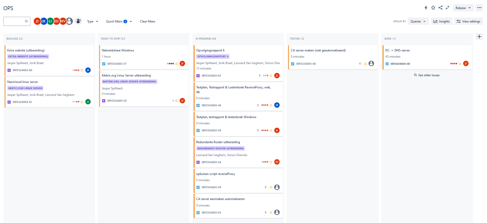
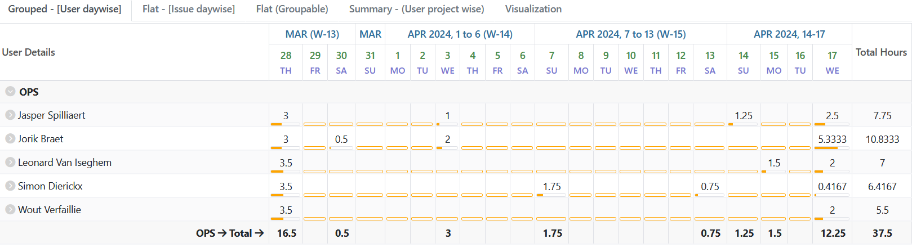
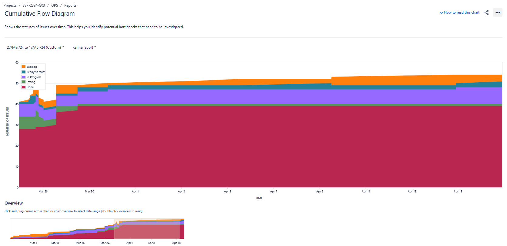
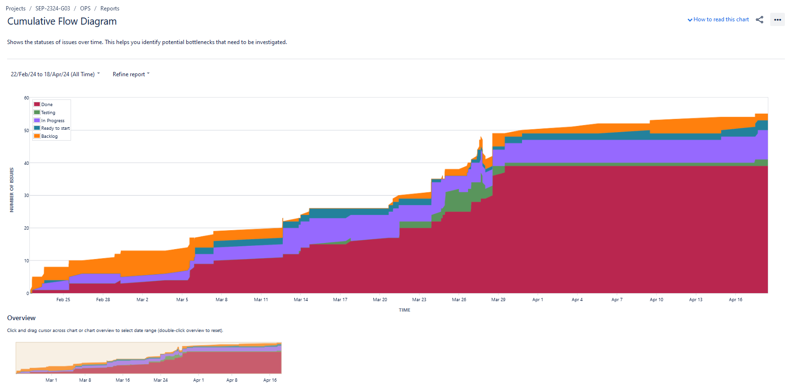
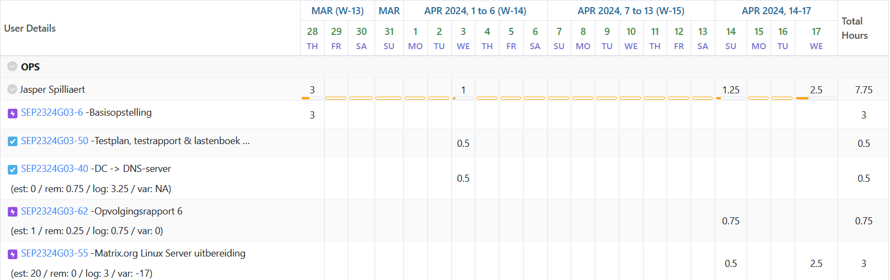
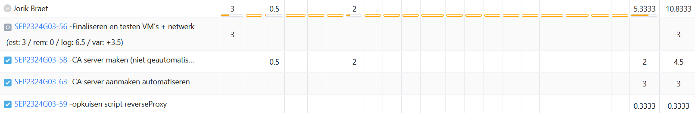
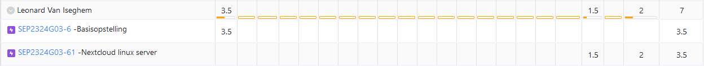
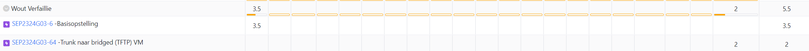
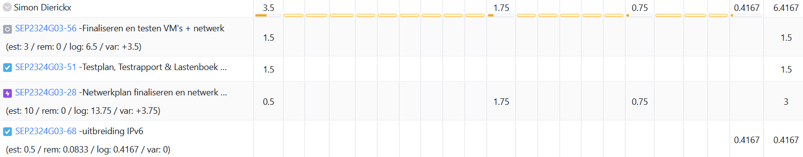

# Opvolgingsrapport 6

## Algemeen

- Groep: G03
- Periode: 27/03/2024 tot 17/04/2024
- Datum voortgangsgesprek: 18/04/2024

| Student             | Afw. | Opmerking |
| :------------------ | :--: | :-------- |
| Jasper Spilliaert   |      |           |
| Jorik Braet         |      |           |
| Leonard Van Iseghem |      |           |
| Wout Verfaillie     |      |           |
| Simon Dierickx      |      |           |

## Wat heb je deze periode gerealiseerd?

### Algemeen

- Takenverdeling en planning gemaakt uitbereidingen
- (vul nog verder aan)
- ...

#### KanBan

<!-- Voeg hier een screenshot toe van de huidige toestand van het kanban bord. -->

#### Tijdsregistratie

<!-- Voeg hier een screenshot toe van het teamoverzicht van de tijdregistratie, met totaal per student en team -->

#### Cumulatief flow diagram

<!-- Voeg hier een screenshot toe van het cumulatief flow diagram voor de periode van het rapport. -->
Cumulative Flow Diagram (periode)

<!-- Voeg hier een screenshot toe van het cumulatief flow diagram voor de volledige periode van het project. -->
Cumulative Flow Diagram (volledig project)

### Jasper Spilliaert

<!-- Voeg hier een overzicht toe van gerealiseerde taken inclusief links naar relevante commits/documenten. -->

- Testrapport getest en aangevuld tijdens basisopstelling
- Takenverdeling en planning uitbereidingen
- DNS script verder aanvullen van demo
- Matrix.org provisioning al redelijk uitgebreid (juist Nginx nog fixen)
- opvolgingsrapporten aanvullen

<!-- Voeg hier een screenshot van het individueel tijdregistratierapport, met overzicht van elke taak en bijhorende uren. -->

### Jorik Braet

<!-- Voeg hier een overzicht toe van gerealiseerde taken inclusief links naar relevante commits/documenten. -->

- CA server configureren
- extra website uitbreiding maken 

<!-- Voeg hier een screenshot van het individueel tijdregistratierapport, met overzicht van elke taak en bijhorende uren. -->

### Leonard Van Iseghem

<!-- Voeg hier een overzicht toe van gerealiseerde taken inclusief links naar relevante commits/documenten. -->

- Basisopsteling opgezet en getroubleshoot voor toonmoment
- Begonnen aan Nextcloud server, kan de hoofdpagina curlen (76554b4)
<!-- Voeg hier een screenshot van het individueel tijdregistratierapport, met overzicht van elke taak en bijhorende uren. -->

### Wout Verfaillie

<!-- Voeg hier een overzicht toe van gerealiseerde taken inclusief links naar relevante commits/documenten. -->

- Testrapport getest en aangevuld tijdens basisopstelling
- Takenverdeling en planning uitbereidingen
- Basisopsteling opgezet en getroubleshoot voor toonmoment
- Begonnen aan uitbreiding trunk naar bridged TFTP

### Simon Dierickx

<!-- Voeg hier een overzicht toe van gerealiseerde taken inclusief links naar relevante commits/documenten. -->

- Netwerk opstellen en tonen tijdens basisopstelling
- Bespreking uitbreidingen

<!-- Voeg hier een screenshot van het individueel tijdregistratierapport, met overzicht van elke taak en bijhorende uren. -->

## Wat plan je volgende periode te doen?

### Algemeen

<!-- Voeg hier de doelstellingen toe voor volgende periode. -->

- ...

### Jasper Spilliaert

<!-- Voeg hier de individuele doelstellingen toe voor volgende periode. -->

- Proberen volledig Matrix.org linux server uitbereiding af te krijgen
- Evt. meehelpen met de rest moest ik klaar zijn

### Jorik Braet

<!-- Voeg hier de individuele doelstellingen toe voor volgende periode. -->

- CA server laten werken voor https geautomatiseerd
- nginx extra website configuratie  

### Leonard Van Iseghem

<!-- Voeg hier de individuele doelstellingen toe voor volgende periode. -->

- Nextcloud af hebben
- Helpen bij andere uitbreidingen of eventueel nog een uitbreiding starten

### Wout Verfaillie

<!-- Voeg hier de individuele doelstellingen toe voor volgende periode. -->

- proberen trunk naar bridged TFTP af te krijgen

### Simon Dierickx

<!-- Voeg hier de individuele doelstellingen toe voor volgende periode. -->

- HSRP IPv4 + HSRP IPv6 volledig werkende krijgen bovenop basisopstelling

## Retrospectieve

### Wat doen jullie goed?

<!-- Voeg hier zaken toe die jullie goed doen naar het proces toe. -->

- ...
- ...

### Waar hebben jullie nog problemen mee?

<!-- Voeg hier zaken toe die volgens jullie beter kunnen naar het proces toe. -->

- Jira analyse moet wat beter opgevolgd worden (uren/opvolgingsrapporten)
- Testplannen/Testrapporten

### Feedback

#### Groep

#### Student 1

#### Student 2

#### Student 3

#### Student 4

#### Student 5
