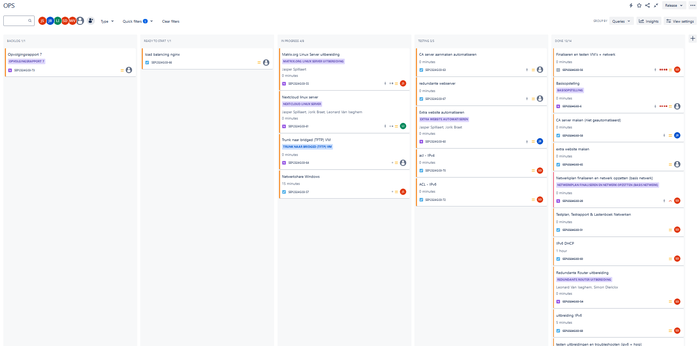
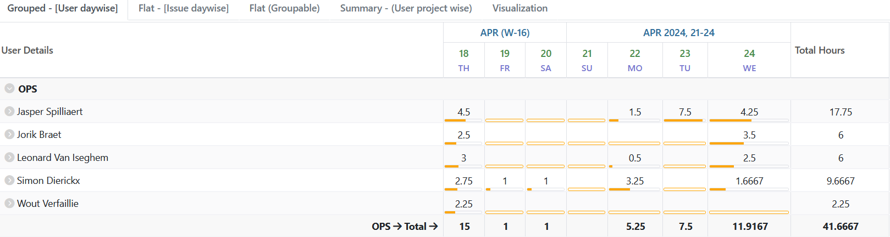
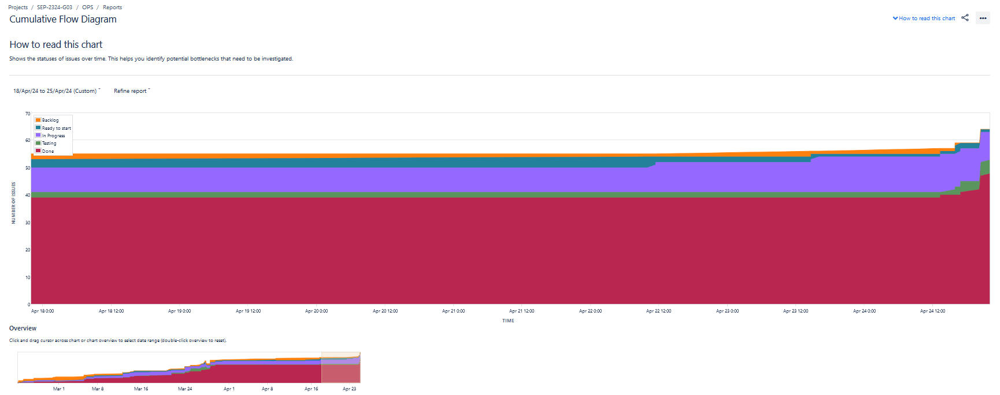
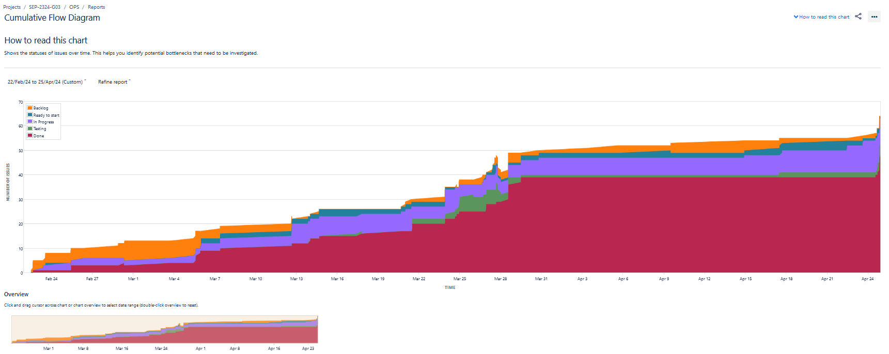
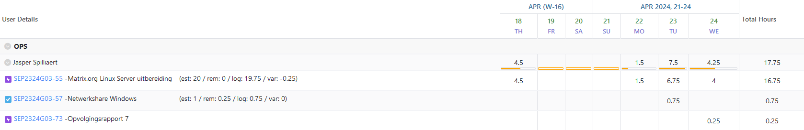
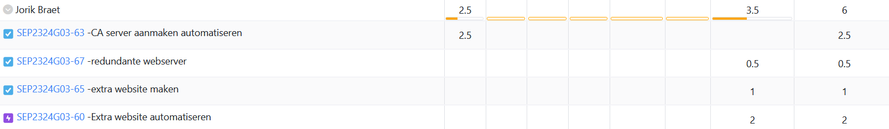
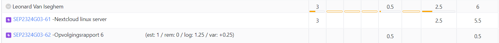
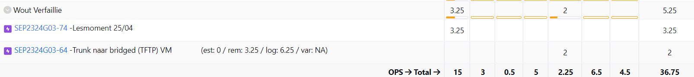
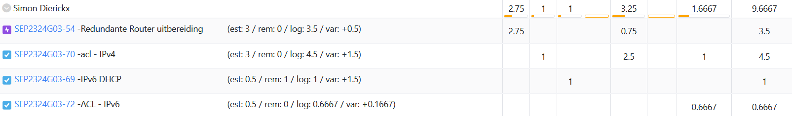

# Opvolgingsrapport 7

## Algemeen

- Groep: G03
- Periode: 18/04/2024 tot 24/04/2024
- Datum voortgangsgesprek: 25/04/2024

| Student             | Afw. | Opmerking |
| :------------------ | :--: | :-------- |
| Jasper Spilliaert   |      |           |
| Jorik Braet         |      |           |
| Leonard Van Iseghem |      |           |
| Wout Verfaillie     |      |           |
| Simon Dierickx      |      |           |

## Wat heb je deze periode gerealiseerd?

### Algemeen

- Matrix.org uitbereiding flink uitgebreid
- Extra website uitbereiding zo goed als afgewerkt
- CA uitbereiding afgewerkt
- ...

#### KanBan

<!-- Voeg hier een screenshot toe van de huidige toestand van het kanban bord. -->

#### Tijdsregistratie

<!-- Voeg hier een screenshot toe van het teamoverzicht van de tijdregistratie, met totaal per student en team -->

#### Cumulatief flow diagram

<!-- Voeg hier een screenshot toe van het cumulatief flow diagram voor de periode van het rapport. -->
Cumulative Flow Diagram (periode)

<!-- Voeg hier een screenshot toe van het cumulatief flow diagram voor de volledige periode van het project. -->
Cumulative Flow Diagram (volledig project)

### Jasper Spilliaert

<!-- Voeg hier een overzicht toe van gerealiseerde taken inclusief links naar relevante commits/documenten. -->

- Matrix.org Linux Server grotendeels afgewerkt, enkel nog connectie Element + bridge naar discord maken/testen (1e13144, ...)
- Networkshare bijgewerkt Windows (1e13144)
- Opvolgingsrapport week 7 

<!-- Voeg hier een screenshot van het individueel tijdregistratierapport, met overzicht van elke taak en bijhorende uren. -->

### Jorik Braet

<!-- Voeg hier een overzicht toe van gerealiseerde taken inclusief links naar relevante commits/documenten. -->

- redundante webserver maken
- extra website uitbreiding
- CA server afmaken

<!-- Voeg hier een screenshot van het individueel tijdregistratierapport, met overzicht van elke taak en bijhorende uren. -->

### Leonard Van Iseghem

<!-- Voeg hier een overzicht toe van gerealiseerde taken inclusief links naar relevante commits/documenten. -->

- 

<!-- Voeg hier een screenshot van het individueel tijdregistratierapport, met overzicht van elke taak en bijhorende uren. -->

### Wout Verfaillie

<!-- Voeg hier een overzicht toe van gerealiseerde taken inclusief links naar relevante commits/documenten. -->

- Trunk naar bridged VM
- Opvolging week 7

### Simon Dierickx

<!-- Voeg hier een overzicht toe van gerealiseerde taken inclusief links naar relevante commits/documenten. -->

- ACL's voor IPv4 volledig uitwerken in PT
- ACL's voor IPv6 volledig uitwerken in PT
- Volledige opstelling terug uittesten want problemen vorige week

<!-- Voeg hier een screenshot van het individueel tijdregistratierapport, met overzicht van elke taak en bijhorende uren. -->

## Wat plan je volgende periode te doen?

### Algemeen

<!-- Voeg hier de doelstellingen toe voor volgende periode. -->

- Geplande uitbereidingen (7) klaar voor trial-run.

### Jasper Spilliaert

<!-- Voeg hier de individuele doelstellingen toe voor volgende periode. -->

- Matrix.org uitbereiding helemaal af krijgen
- Helpen met extra website uitbereiding
- Helpen waar nodig

### Jorik Braet

<!-- Voeg hier de individuele doelstellingen toe voor volgende periode. -->

- load balancing van nginx
- CA volledig afwerken 
- automatisatie extra website

### Leonard Van Iseghem

<!-- Voeg hier de individuele doelstellingen toe voor volgende periode. -->

- ...

### Wout Verfaillie

<!-- Voeg hier de individuele doelstellingen toe voor volgende periode. -->

- ...

### Simon Dierickx

<!-- Voeg hier de individuele doelstellingen toe voor volgende periode. -->

- ACL's troublehsooten indien nodig
- NAT implementeren
- Wireless Access Point als uitbreiding

## Retrospectieve

### Wat doen jullie goed?

<!-- Voeg hier zaken toe die jullie goed doen naar het proces toe. -->

- iedereen weet redelijk goed hoe alles in elkaar zit

### Waar hebben jullie nog problemen mee?

<!-- Voeg hier zaken toe die volgens jullie beter kunnen naar het proces toe. -->

- uren kunnen beter gelogged worden

### Feedback

#### Groep

#### Student 1

#### Student 2

#### Student 3

#### Student 4

#### Student 5
