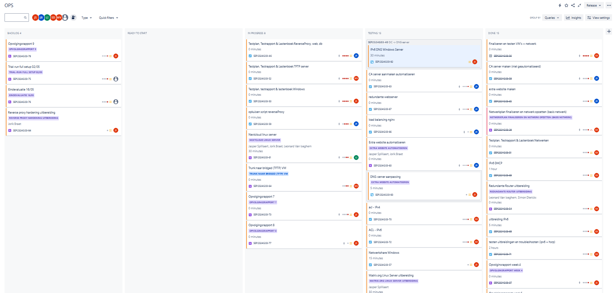
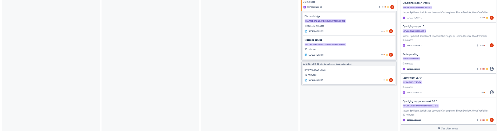
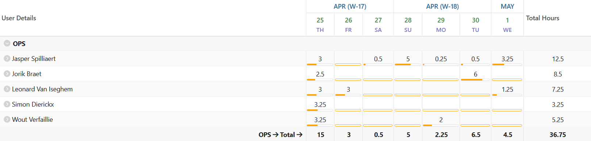
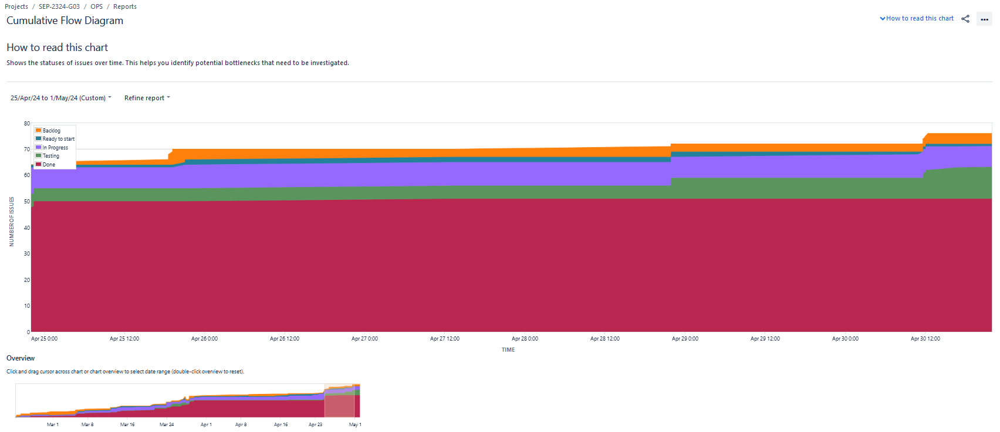
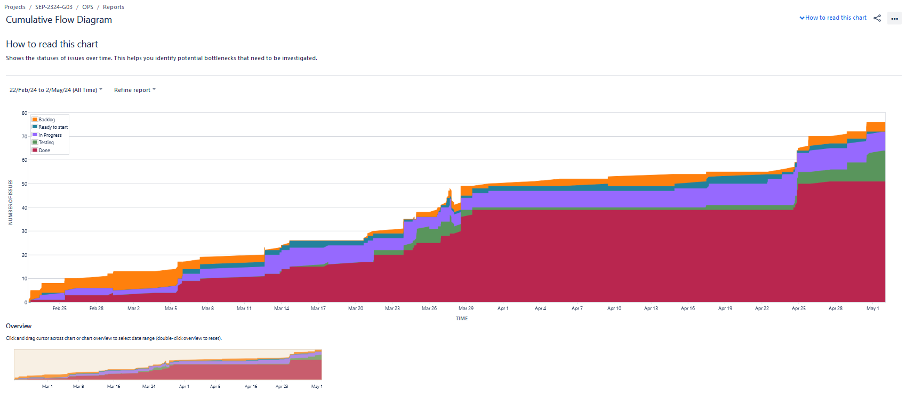
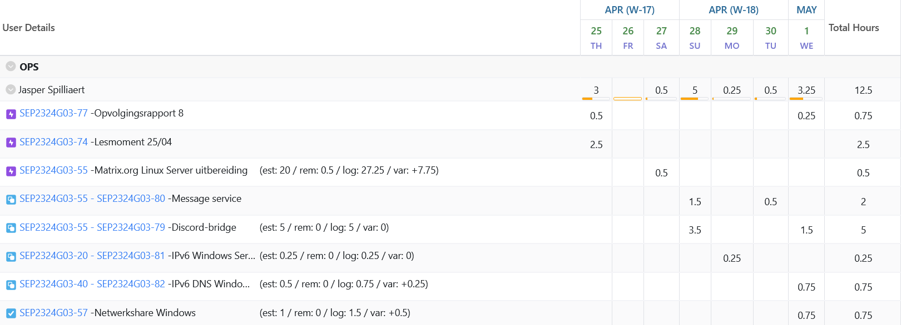
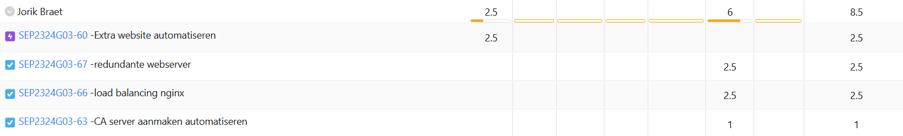
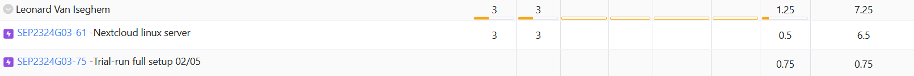
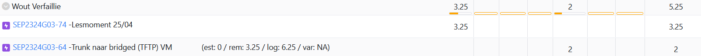
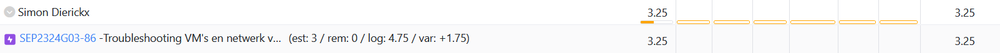

# Opvolgingsrapport 8

## Algemeen

- Groep: G03
- Periode: 25/04/2024 tot 01/05/2024
- Datum voortgangsgesprek: 02/05/2024

| Student             | Afw. | Opmerking |
| :------------------ | :--: | :-------- |
| Jasper Spilliaert   |      |           |
| Jorik Braet         |      |           |
| Leonard Van Iseghem |      |           |
| Wout Verfaillie     |      |           |
| Simon Dierickx      |      |           |

## Wat heb je deze periode gerealiseerd?

### Algemeen

- CA certificate uitbereiding klaar
- Extra website uitbereiding klaar
- Matrix.org uitbereiding zo goed als klaar
- Nextcloud uitbereiding zo goed als klaar
- ...

#### KanBan

<!-- Voeg hier een screenshot toe van de huidige toestand van het kanban bord. -->

#### Tijdsregistratie

<!-- Voeg hier een screenshot toe van het teamoverzicht van de tijdregistratie, met totaal per student en team -->

#### Cumulatief flow diagram

<!-- Voeg hier een screenshot toe van het cumulatief flow diagram voor de periode van het rapport. -->

Cumulative Flow Diagram (periode)

<!-- Voeg hier een screenshot toe van het cumulatief flow diagram voor de volledige periode van het project. -->

Cumulative Flow Diagram (volledig project)

### Jasper Spilliaert

<!-- Voeg hier een overzicht toe van gerealiseerde taken inclusief links naar relevante commits/documenten. -->

- Matrix.org uitbereiding -> bridge naar discord, message service
- IPv6 Windows Server
- IPv6 Windows Server DNS
- Networkshares Windows Server werkend
- Opvolgingsrapport 8

<!-- Voeg hier een screenshot van het individueel tijdregistratierapport, met overzicht van elke taak en bijhorende uren. -->

### Jorik Braet

<!-- Voeg hier een overzicht toe van gerealiseerde taken inclusief links naar relevante commits/documenten. -->

- Extra website
- Redundante webserver uitbereiding werkt
- load belancing nginx
- CA uitbereiding werk

<!-- Voeg hier een screenshot van het individueel tijdregistratierapport, met overzicht van elke taak en bijhorende uren. -->

### Leonard Van Iseghem

<!-- Voeg hier een overzicht toe van gerealiseerde taken inclusief links naar relevante commits/documenten. -->

- Nextcloud linux server uitbereiding

<!-- Voeg hier een screenshot van het individueel tijdregistratierapport, met overzicht van elke taak en bijhorende uren. -->

### Wout Verfaillie

- Verder gewerkt aan Trunk naar bridged (TFTP) VM uitbereiding

<!-- Voeg hier een overzicht toe van gerealiseerde taken inclusief links naar relevante commits/documenten. -->

### Simon Dierickx

<!-- Voeg hier een overzicht toe van gerealiseerde taken inclusief links naar relevante commits/documenten. -->

- Troubleshooten VM's en netwerk
- Instellen NAT
- Instellen ACL's

<!-- Voeg hier een screenshot van het individueel tijdregistratierapport, met overzicht van elke taak en bijhorende uren. -->

## Wat plan je volgende periode te doen?

### Algemeen

<!-- Voeg hier de doelstellingen toe voor volgende periode. -->

- Alles gereed maken voor de Eindopstelling

### Jasper Spilliaert

<!-- Voeg hier de individuele doelstellingen toe voor volgende periode. -->

- Matrix.org discord bridge
- Reverse proxy hardening
- Testplan en testrapporten
- Lastenboeken

### Jorik Braet

<!-- Voeg hier de individuele doelstellingen toe voor volgende periode. -->

- reverse proxy hardening
- opkuisen script
- test runs

### Leonard Van Iseghem

<!-- Voeg hier de individuele doelstellingen toe voor volgende periode. -->

- ...

### Wout Verfaillie

<!-- Voeg hier de individuele doelstellingen toe voor volgende periode. -->

- ...

### Simon Dierickx

<!-- Voeg hier de individuele doelstellingen toe voor volgende periode. -->

- NAT verder uitwerken
- NOG STEEDS TROUBLESHOOTEN.......
- ACL's implementeren

## Retrospectieve

### Wat doen jullie goed?

<!-- Voeg hier zaken toe die jullie goed doen naar het proces toe. -->

- We leveren onze taken tijdig af en hebben altijd afspraken binnen de groep. Als we vast zitten helpen we elkaar ook

### Waar hebben jullie nog problemen mee?

<!-- Voeg hier zaken toe die volgens jullie beter kunnen naar het proces toe. -->

- Soms analyse maar er zit een verbetering in

### Feedback

#### Groep

#### Student 1

#### Student 2

#### Student 3

#### Student 4

#### Student 5
