# Testplan

- Auteur(s) testplan: Simon Dierickx

## Test: Is de toegang "beveiligd"?
Testprocedure:
1. Router of switch opstarten en kijken of er een bericht komt om toegang te beperken
2. Wachtwoord moeten ingeven (kan niet in labomgeving).

Verwacht resultaat:

- 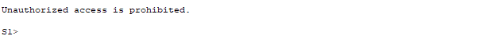 
- 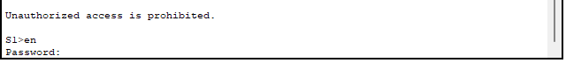

## Test: Werken de basis functies van het netwerk (pings)
Testprocedure:
1. Pings vanop de netwerktoestellen (binnen het netwerk)
2. Pings vanop een server of client (binnen het netwerk)

Verwacht resultaat:

- 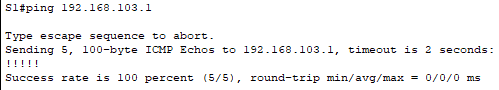
- 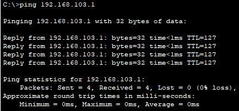

## Test: Zijn de routers redundant
Testprocedure:
1. Bij het opstarten de staat van de interfaces bekijken
2. Ping starten met beide routers ingeplugs, master router uittrekken en pings bekijken

Verwacht resultaat:

- Interfaces op R1: 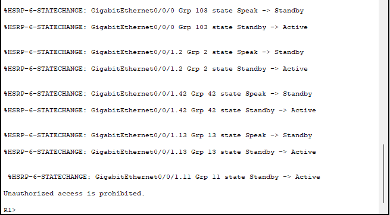 Interfaces op R1BackUp: 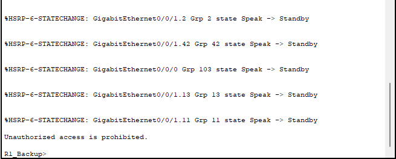
- 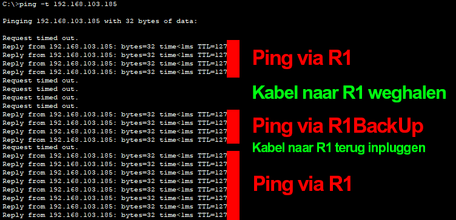

## Test: Werkt NAT?
Testprocedure:
1. Naar IP buiten pingen
2. Naar URL 
3. Naar buiten surfen

Verwacht resultaat:

- 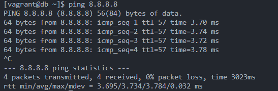
- 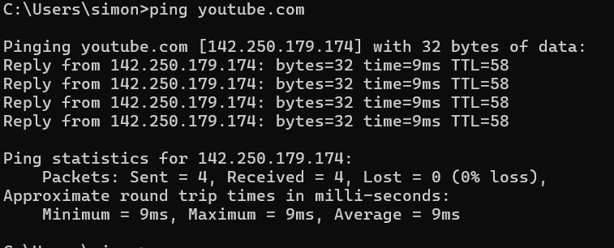
- 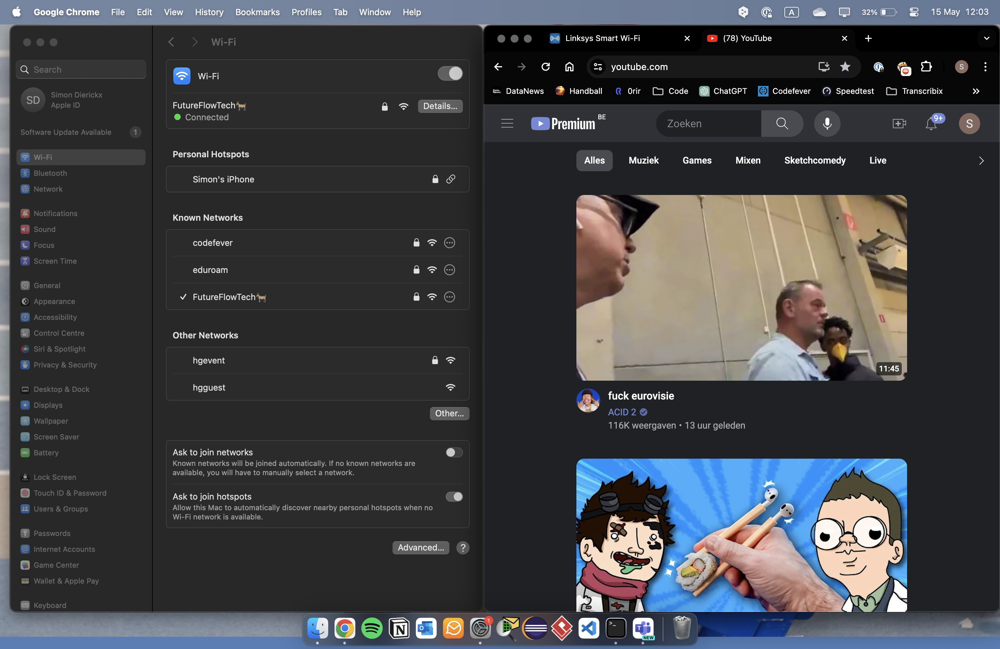

## Test: Werkt NAT Port forwarding?
Testprocedure:
1. Vanop het klasnetwerk naar sepgroup03.hogent.be surfen en onze website zien

Verwacht resultaat:
- 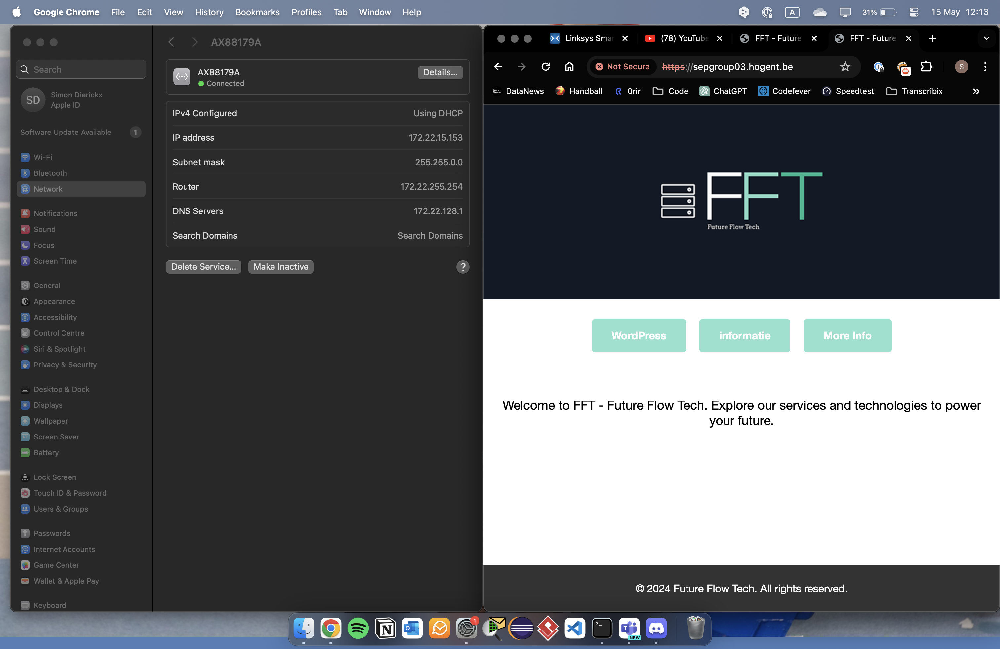
