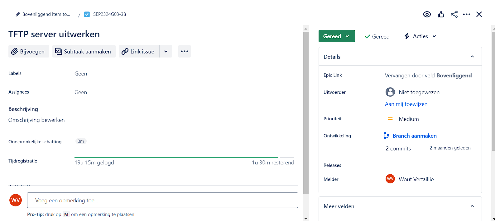

# Lastenboek

## Deliverables

- Installeer een TFTP-server.
- Netwerktoestellen worden via deze TFTP-server geconfigureerd
- De automatische installatie kopieert de netwerkconfiguraties naar de juiste map op deze server

## Deeltaken

<!-- Som hier de deeltaken voor deze opdracht op en duid voor elk een verantwoordelijke en tester aan. Vermeld ook afhankelijkheden tussen deeltaken als die er zijn. Elke deeltaak wordt een kaartje op het kanban-bord! -->

1. Connectie tussen TFTP Server en netwerktoestellen
   - Verantwoordelijke: Wout Verfaillie
   - Tester: Simon Dierickx
2. Backup van netwerktoestellen via TFTP
   - Verantwoordelijke: Wout Verfaillie
   - Tester: Simon Dierickx

## Tijdbesteding

| Student       | Geschat | Gerealiseerd |
| :------------ | ------: | -----------: |
| Wout Verfaillie | 18u        |      20u        |
| **Totaal**    |   18u      |     20u         |

<!-- Voeg na oplevering van de taak een schermafbeelding van rapport tijdbesteding voor deze taak toe. -->

