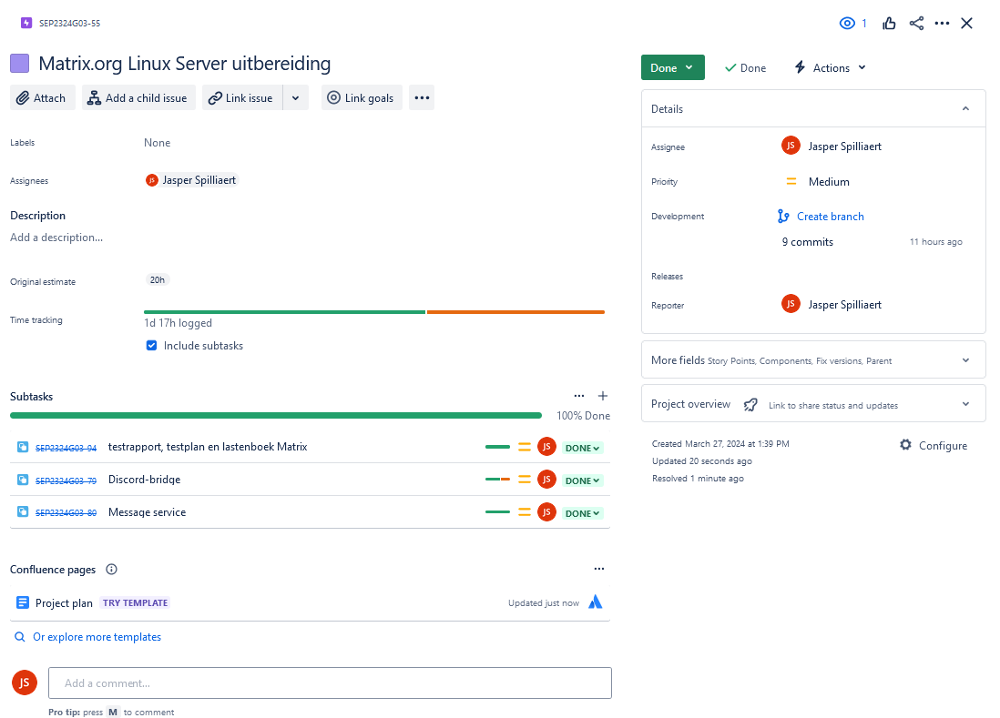

# Lastenboek Matrix.org

## Deliverables

<!-- Som hier de concrete eindresultaten op die je voor deze opdracht moet opleveren. -->

| Deeltaak |                       Deliverable                       | Gerealiseerd |
| :------: | :-----------------------------------------------------: | :----------: |
|    1     |                         vagrant                         |      V       |
|    1     |                     Bridged adapter                     |      V       |
|    1     |                  De provisioning werkt                  |      V       |
|  1,2,3   |                  Alle services runnen                   |      V       |
|   1,2    |                  De room is aangemaakt                  |      V       |
|    1     |         Je kan een geëncrypteerd gesprek voeren         |      V       |
|    1     |                  Alle services runnen                   |      V       |
|    2     |                       nginx werkt                       |      V       |
|    2     |   Waarschuwing wordt weergegeven in de Encrypted Room   |      V       |
|    3     |                     Discord Account                     |      V       |
|    3     |                      Discord Guild                      |      V       |
|    3     |    Discord Bot met Administrator rechten in de Guild    |      V       |
|    3     |  Gesprek met Discord Bot wordt automatisch beantwoord   |      V       |
|    3     |          Succesvol inloggen met token van bot           |      V       |
|    3     |   De Guilds bridge wordt aangemaakt in de testruimte    |      V       |
|    3     | Je kunt communiceren tussen Element en de Discord Guild |      V       |

## Deeltaken

<!-- Som hier de deeltaken voor deze opdracht op en duid voor elk een verantwoordelijke en tester aan. Vermeld ook afhankelijkheden tussen deeltaken als die er zijn. Elke deeltaak wordt een kaartje op het kanban-bord! -->

1. Geëncrypteerd gesprek tussen 2 users
   - Verantwoordelijke: Jasper Spilliaert
   - Tester: Leonard Van Iseghem
2. Notificatie webserver
   - Verantwoordelijke: Jasper Spilliaert
   - Tester: Leonard Van Iseghem
3. Discord Bridge
   - Verantwoordelijke: Jasper Spilliaert
   - Tester: Leonard Van Iseghem

## Tijdbesteding

| Student             | Geschat | Gerealiseerd |
| :------------------ | ------: | -----------: |
| Jasper Spilliaert   |     20u |          41u |
| Leonard Van Iseghem |       X |           2u |
| **Totaal**          |         |          43u |

<!-- Voeg na oplevering van de taak een schermafbeelding van rapport tijdbesteding voor deze taak toe. -->

