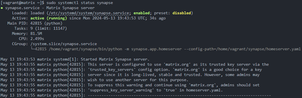
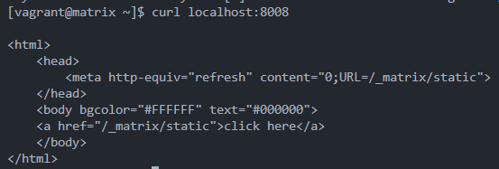
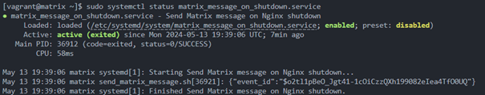
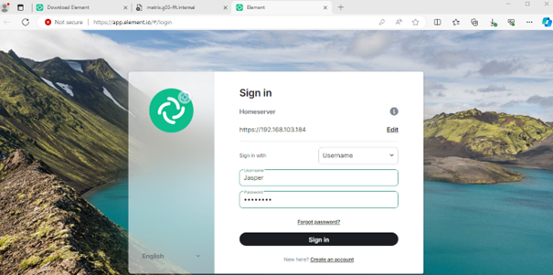
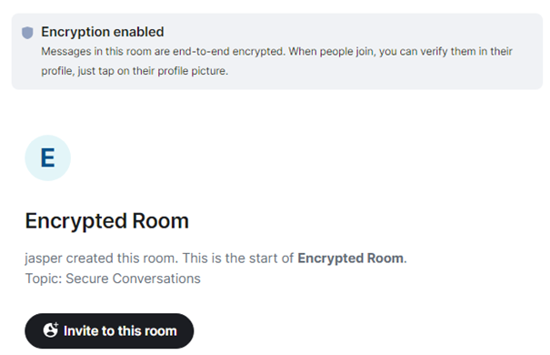
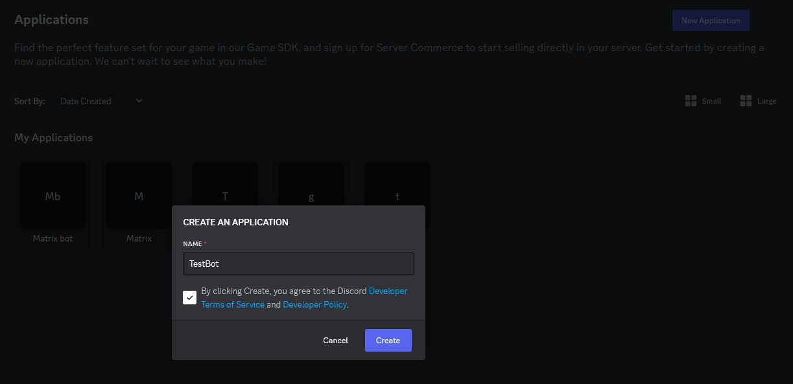
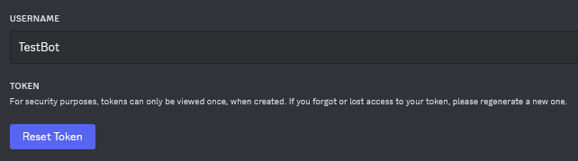
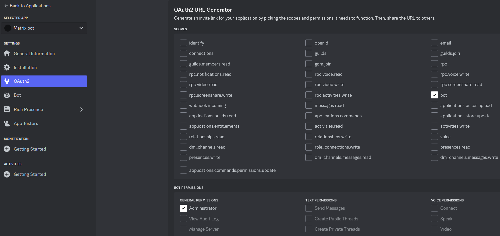
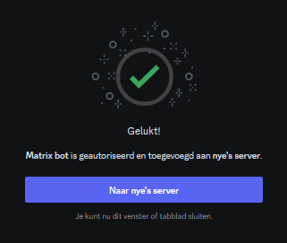
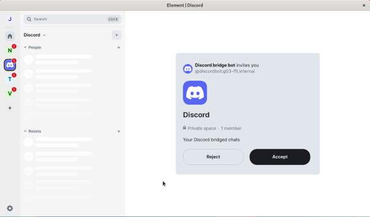

# Testplan Matrix.org

- Auteur(s) testplan: Jasper Spilliaert

## Test: Is de provisioning succesvol gelukt?

Testprocedure: voer binnen de map /sep23-gent-g03/uitwerking/VMs/Linux het volgende commando in:

```powershell
    vagrant up matrix
```

Verwacht resultaat:


## Test: Staat de Synapse service aan en werk die op localhost?

Testprocedure: Kijk na de provisioning of de synapse service draait door middel van volgende commando's.

```bash
    sudo systemctl status synapse
```

```bash
    curl localhost:8008
```

Verwacht resultaat:




## Test: Staat de webserver message service aan?

Testprocedure: Kijk of de webserver message service werkt zodat die berichten kan sturen naar de Encrypted Room.

```bash
    sudo systemctl status matrix_message_on_shutdown.service
```



## Test: Staat de discord service aan?

Testprocedure: Na de provisioning moet er gekeken worden of de discord service draait met het volgende commando:

```bash
    sudo systemctl status discord
```

Verwacht resultaat:


## Test: Kan je via Element op de WinClient de homeserver bereiken?

Testprocedure: 

- Ga naar [Element](https://app.element.io/#/login), Druk bij homeserver op Edit en voer het homeserver adres in: https://matrix.g03-fft.internal

Verwacht resultaat:



Opmerkingen: Bij lokaal testen werkt enkel het IP-address van de VM en niet het domain zonder ReverseProxy.

## Test: Is de Encrypted room succesvol aangemaakt en kun je een geëncrypteerd gesprek voeren met 2 users?

Testprocedure:

- Log in op 2 incongnito browsers op de homeserver met de gebruikers Jasper en Jorik
- Kijk of de room aangemaakt is en of de gebruiker Jasper erin zit
- Jasper inviteert Jorik tot het gesprek
- Stuur een bericht en kijk of het werkt

Verwacht resultaat:




## Test: Wordt er een bericht verstuurd wanneer je de webserver stopt of heropstart?

Testprocedure:

- Ga naar de Encrypted room en voer het volgende commando uit op de matrix.org server:

```bash
    sudo systemctl restart nginx
```

Verwacht resultaat:


## Test: Heb je een Discord bot? En heeft die discord bot Administrator rechten op een Discord guild?

Testprocedure:

1. Zorg er eerst voor dat je een Discord account en Discord server hebt! -> Je kan je hiervoor registreren op Discord.com en een server maak je door in de discord applicatie of browser op het plusje te klikken en dan op "Create my Own" + "For me and my friends" en klik dan op Create.

Verwacht resultaat:


2. Dan maak je een Discord bot aan en daarvoor ga je naar [Discord Developer Portal](https://discord.com/developers/applications). Hiervoor klik je op de knop "New application", geef je discord bot daarna een naam en druk op "Create". Nu is je bot aangemaakt

Verwacht resultaat:




3. Nu moet je de Bot toevoegen aan de Discord server. Eerst moet je een token krijgen van de bot en dat doe je door op aan de linker kant te klikken op "Bot" en dan druk je op Reset Token en kopiëer je die en sla je die ergens op (deze heb je later nodig). Na dat je dit deed klik je nu links op het tabblad "0Auth2". Ga naar URL Generator -> Selecteer bij "Scopes": bot, "Bot Permissions": Administrator. Nu zal je onderaan een link te zien krijgen. Kopiëer deze en plak die in je browser. Nu zal er gevraagd worden aan welke server je de bot wil toevoegen en dan kies je je gewenste server. Hierna zal er staan "Gelukt" en dan kan je klikken om naar de server te gaan.

Verwacht resultaat:






Eindresultaat:


## Test: Werkt de Discord bridge?

Testprocedure:

- Log in als gebruiker Jasper of Jorik op Element op de homeserver
- Start een chat met de discordbot: People > New Chat > user: @discordbot:matrix.g03-fft.internal 
- Stuur een bericht naar de Discord bot (die zal automatisch antwoorden), en voer het volgende commando in om je discord Bot te connecteren:

```bash
    login-token bot <Token-ID>
```
Verwacht resultaat:


- Maak hierna een unencrypted room (Encryption wordt niet gesupport voor discord!!) aan en invite de Discord bot. Stuur dan het volgende in de chat door:

```bash
    !discord guilds bridge <Guild-ID>
```

Verwacht resultaat:


- De gebruiker werd nu geïnviteerd door de Discord Bot om de Server te joinen. Accepteer dit. Daarna verstuur je als discord-user een bericht in een channel en krijgt de user hier ook een invite toe.

Verwacht resultaat:




