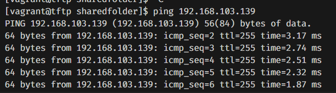
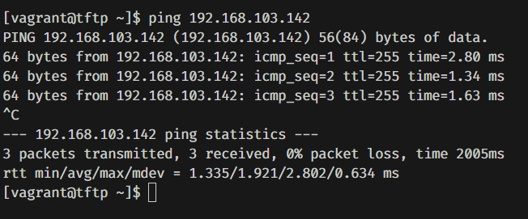
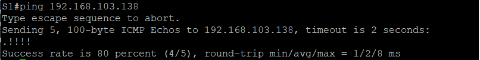

# Testplan

- Auteur(s) testplan: Wout Verfaillie<!--Naam. -->


## Test: TFTP kan pingen naar de correcte netwerktoestellen

Testprocedure:

1. Vanuit de tftp server pingen naar S1 en R1

Verwacht resultaat:

- De tftp server kan pingen naar S1 en R1

S1:
```bash
ping 192.168.103.139
```



R1:
```bash
ping 192.168.103.142
```




## Test: Netwerktoestellen worden via TFTP correct geconfigureerd

Testprocedure:

1. Ping vanuit een netwerktoestel naar de tftp server
2. Kopieer de configuratie van de tftp server naar het netwerktoestel
3. Kijk of de configuratie van het netwerktoestel correct is in de running-config

Verwacht resultaat:

- De netwerktoestellen kunnen pingen naar de tftp server


```bash
S1#ping 192.168.103.138
```



- De configuratie van de tftp server wordt correct gekopieerd naar het netwerktoestel

```bash
S1#copy ftp: running-config
```

- De configuratie van het netwerktoestel is correct in de running-config

```bash
S1#show running-config
```

