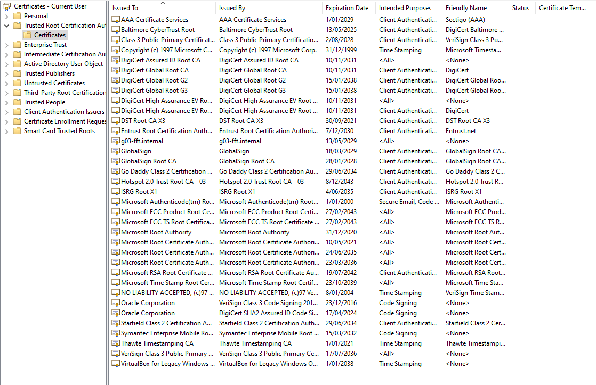

# Testrapport

- Uitvoerder(s) test: Simon<!-- Naam. -->
- Uitgevoerd op: 14/05/2024<!-- Datum. -->
- Github commit: 8145327<!-- Git commit hash. -->

## Test: windows script installeer het CA certificaat<!-- Omschrijving test. -->

Test procedure:
- windows script installeert het CA certificaat

Verkregen resultaat:
- CA certificaat staat geïnstalleerd

<!-- Voeg hier eventueel een screenshot van het verkregen resultaat in. -->

Test geslaagd:

- [x] Ja
- [ ] Nee

Opmerkingen:
/

## Test: certificaten op reverse proxy zetten<!-- Omschrijving test. -->

Test procedure:
- met de tftp server worden de CA gegenereerde certificaten op de reverseProxy geplaatst

Verkregen resultaat:
- de certs staan op de reverse proxy

<!-- Voeg hier eventueel een screenshot van het verkregen resultaat in. -->

Test geslaagd:
- [x] Ja
- [ ] Nee

Opmerkingen:
/

## Test: zoeken naar websites<!-- Omschrijving test. -->

Test procedure: 
- zoeken naar https://g03-fft.internal
- zoeken naar https://extra.g03-fft.internal

Verkregen resultaat:
- ik kan zoeken zonder onveiligheid melding

Test geslaagd:
- [x] Ja
- [ ] Nee
