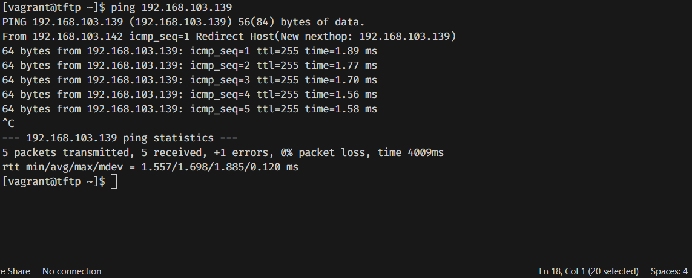
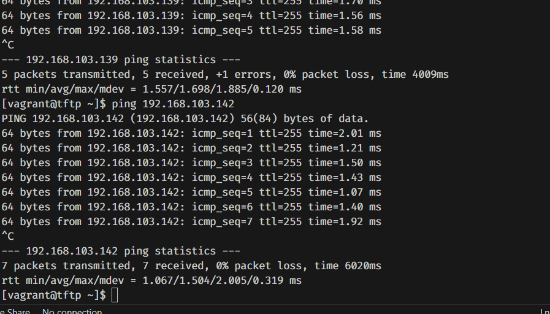

# Testrapport

- Uitvoerder(s) test: Simon Dierickx
- Uitgevoerd op: 15/05/2024
- Auteur testplan: Wout Verfaillie 

## Test: TFTP kan pingen naar de correcte netwerktoestellen

1. Vanuit de tftp server pingen naar S1 en R1

Verwacht resultaat:

- De tftp server kan pingen naar S1 en R1

Verkregen resultaat:

Switch S1:

Router R1:

<!-- Voeg hier eventueel een screenshot van het verkregen resultaat in. -->

Test geslaagd:

- [x] Ja
- [ ] Nee

Opmerkingen:

- /

## Test: Netwerktoestellen worden via TFTP correct geconfigureerd

Test procedure:

1. Ping vanuit een netwerktoestel naar de tftp server
2. Kopieer de configuratie van de tftp server naar het netwerktoestel
3. Kijk of de configuratie van het netwerktoestel correct is in de running-config

Verkregen resultaat:

- S1 kan pingen naar tftp server:

- De configuratie van de tftp server wordt correct gekopieerd naar het netwerktoestel

Test geslaagd:

- [ ] Ja
- [x] Nee

Opmerkingen:

- Het netwerktoestel kan pingen naar de tftp server, maar het netwerktoestel wil de configuratie niet kopieren. 

