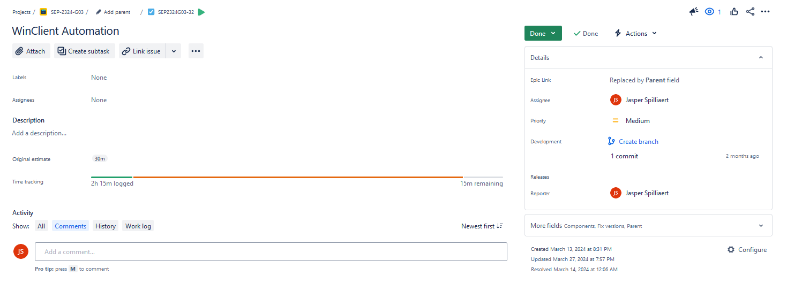

# Lastenboek Windows Client

## Deliverables

<!-- Som hier de concrete eindresultaten op die je voor deze opdracht moet opleveren. -->

| Deeltaak |             Deliverable              | Gerealiseerd |
| :------: | :----------------------------------: | :----------: |
|    1     |            Windows 10 ISO            |      V       |
|    1     |               VDI path               |      V       |
|    1     |           Bridged adapter            |      V       |
|    1     |      VboxManage Guest Additions      |      V       |
|    2     |                 DHCP                 |      V       |
|    2     |   Getransferde files op de Client    |      V       |
|    2     | Pingen naar AD-domain/Windows Server |      V       |
|    2     |    Succesvol domein kunnen joinen    |      V       |
|    2     |     RSAT tools voor serverbeheer     |      V       |
|    2     |               Internet               |      V       |

## Deeltaken

<!-- Som hier de deeltaken voor deze opdracht op en duid voor elk een verantwoordelijke en tester aan. Vermeld ook afhankelijkheden tussen deeltaken als die er zijn. Elke deeltaak wordt een kaartje op het kanban-bord! -->

1. Installatiescript VM
   - Verantwoordelijke: Jasper Spilliaert
   - Tester: Leonard Van Iseghem
2. Configuratie Windows Client 10 VM
   - Verantwoordelijke: Jasper Spilliaert
   - Tester: Leonard Van Iseghem

## Tijdbesteding

| Student             | Geschat | Gerealiseerd |
| :------------------ | ------: | -----------: |
| Jasper Spilliaert   |       X |         ~10u |
| Leonard Van Iseghem |       X |          ~5u |
| **Totaal**          |         |         ~15u |

<!-- Voeg na oplevering van de taak een schermafbeelding van rapport tijdbesteding voor deze taak toe. -->

Geen Epic gemaakt voor WindowsClient, maar gewoon Tasks. Niet echt veel commits gemaakt ook, meer aan gewerkt gedurende testruns en contactmomenten met telkens kleine aanpassingen 

