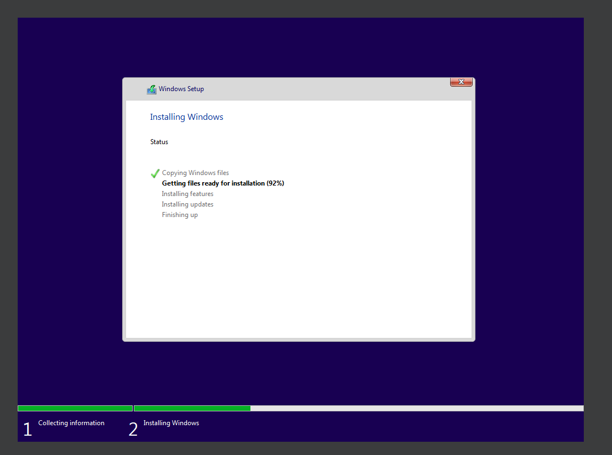
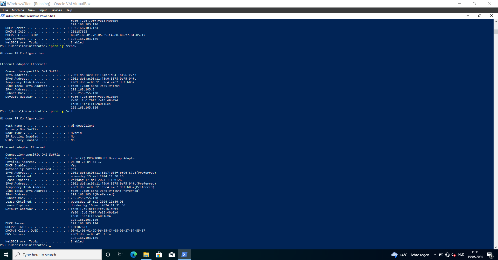
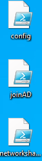
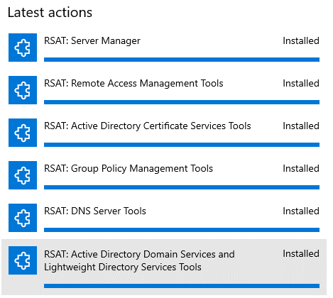
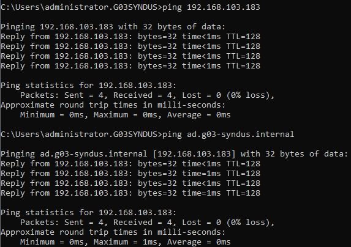
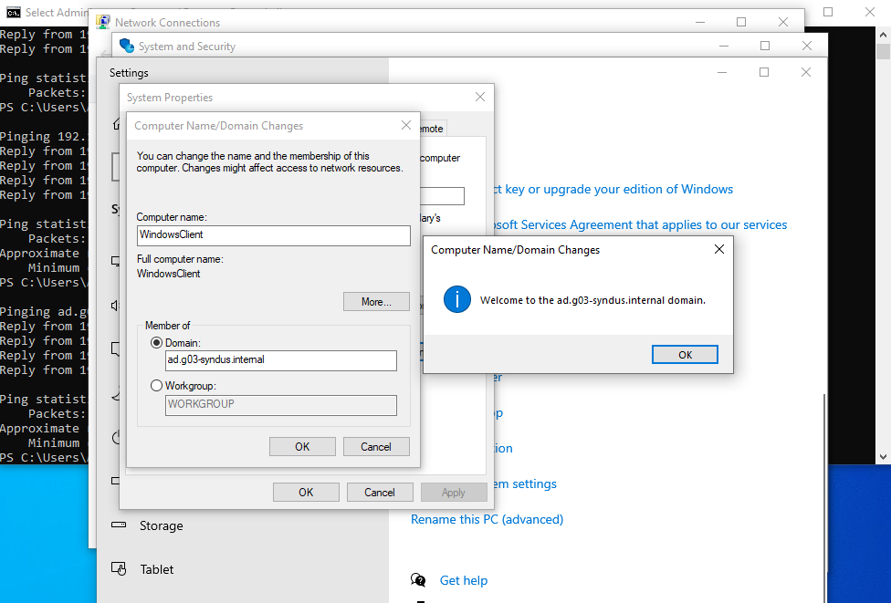
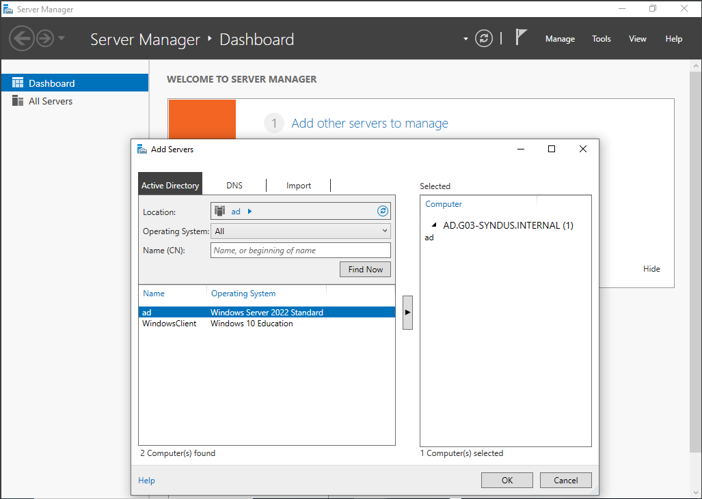
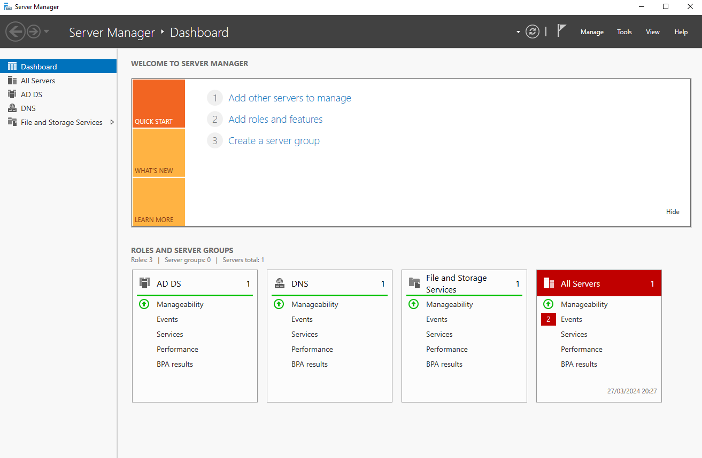
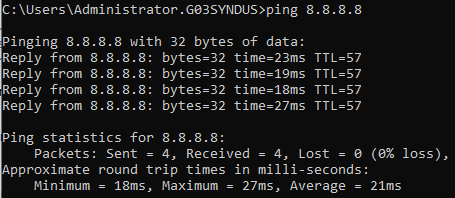
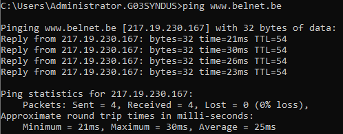

# Testplan Windows Client

- Auteur(s) testplan: Jasper Spilliaert

## Test: Werkt het installatiescript van de WindowsClient?

Test procedure: Voer het WindowsClient.ps1 bestand uit en de VM wordt gemaakt via vboxmanage

Verwacht resultaat:



## Test: Werkt DHCP, krijg je een IPv4 en IPv6 adres op de WinClient?

Testprocedure: De Client krijgt een VM binnen het netwerk

Verwacht resultaat: TODO



## Test: Zijn de config files te zien op het Bureaublad?

Testprocedure: De Client krijgt een VM binnen het netwerk

Verwacht resultaat:



## Test: Zijn de RSAT tools gedownload?

Testprocedure: Voer het config.ps1 script uit om de RSAT tools te installeren

Verwacht resultaat:



## Test: Kan je pingen naar de Windows Server 2022 en naar het domein (ad.g03-syndus.internal)?

Testprocedure:

- Voer een ping uit naar het IP van de Windows server met het volgende commando:

```powershell
    ping 192.168.103.183
```

- Voer een ping uit naar het AD-domain van de Windows server met het volgende commando

```powershell
    ping ad.g03-fft.internal
```

Verwacht resultaat:



## Test: Kan je het AD domein joinen?

Testprocedure: Voer het joinAD.ps1 bestand uit, de server zal automatisch opnieuw opstarten als het AD succesvol gejoined is

Verwacht resultaat:



Opmerking: Hierbij toon ik voor hoe het domein gejoined wordt manueel

## Test: Kan je in de Server manager de server toevoegen?

Testprocedure: 

- Voeg na het downloaden van de RSAT tools in de Server Manager het domein toe via Add other servers to manage, AD find now, ad -> en druk op OK

Verwacht resultaat:




## Test: Kan je pingen naar het internet en belnet.be?

Testprocedure: `ping 8.8.8.8` `ping belnet.be` (krijgt IPv6 voorrang?)

Verwacht resultaat:




