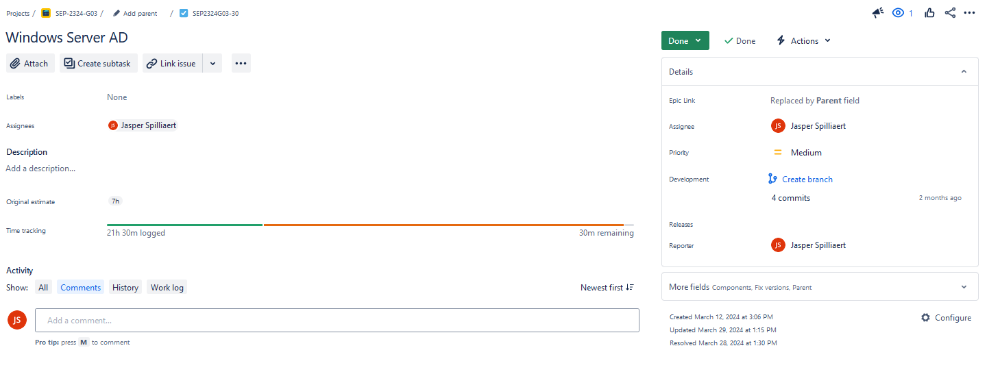
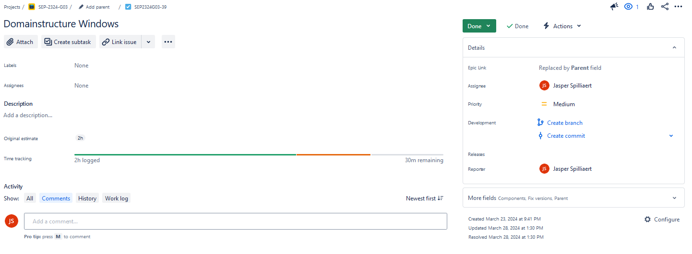
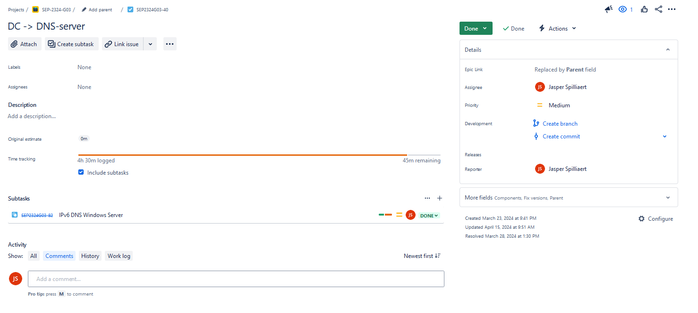
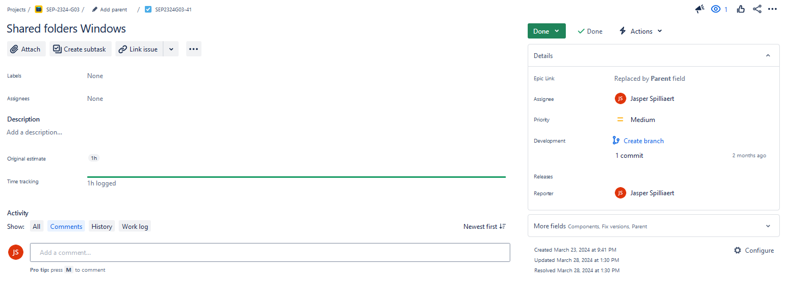
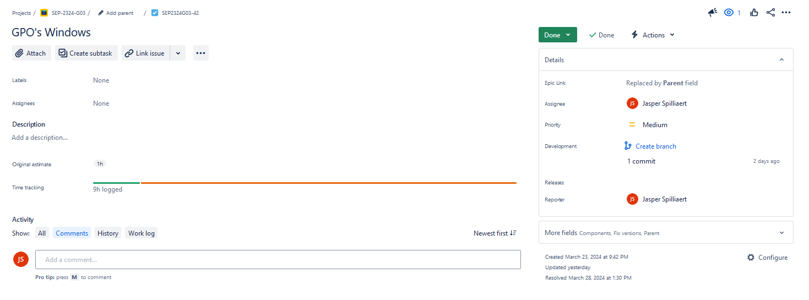
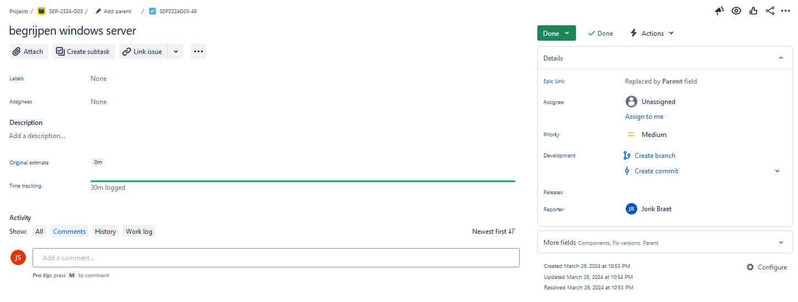
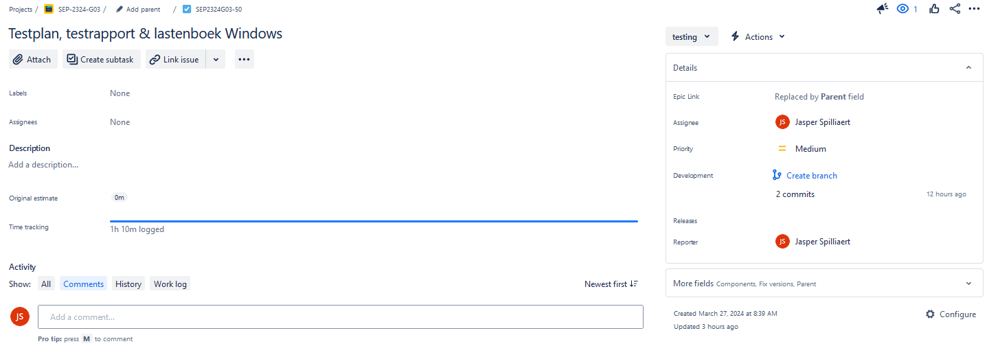

# Lastenboek Windows Server

## Deliverables

<!-- Som hier de concrete eindresultaten op die je voor deze opdracht moet opleveren. -->

| Deeltaak  |                                          Deliverable                                          | Gerealiseerd |
| :-------: | :-------------------------------------------------------------------------------------------: | :----------: |
|     1     |                                    Windows Server 2022 ISO                                    |      V       |
|     1     |                                        Bridged adapter                                        |      V       |
|     1     |                                            VDI pad                                            |      V       |
|     1     |                                      Guest Additions ISO                                      |      V       |
|     1     |                                        Bridged adapter                                        |      V       |
| 2,3,4,5,6 | Overbrengen alle files naar VM -> csv bestanden, config, dns, AD_verdeling, GPO, netwerkshare |      V       |
|     2     |                                  Domain: ad.g03-fft.internal                                  |      V       |
|     3     |                              Domeinstrutuur -> users, computers                               |      V       |
|     4     |                                     DNS-server forwarding                                     |      V       |
|     4     |                          DNS-server binnen ad.g03-fft.internal (PTR)                          |      V       |
|     4     |                        DNS-server records (A, AAAA, CNAME) voor sites                         |      V       |
|     5     |                                        Netwerk shares                                         |      V       |
|     6     |                                     DenyCommandPrompt GPO                                     |      V       |

## Deeltaken

<!-- Som hier de deeltaken voor deze opdracht op en duid voor elk een verantwoordelijke en tester aan. Vermeld ook afhankelijkheden tussen deeltaken als die er zijn. Elke deeltaak wordt een kaartje op het kanban-bord! -->

1. Installatie VM
   - Verantwoordelijke: Jasper Spilliaert
   - Tester: Jorik Braet (14/05/2024)
2. Configuratie
   - Verantwoordelijke: Jasper Spilliaert
   - Tester: Jorik Braet
3. AD_verdeling
   - Verantwoordelijke: Jasper Spilliaert
   - Tester: Jorik Braet
4. DNS
   - Verantwoordelijke: Jasper Spilliaert
   - Tester: Jorik Braet
5. Netwerkshares
   - Verantwoordelijke: Jasper Spilliaert
   - Tester: Jorik Braet
6. GPO's
   - Verantwoordelijke: Jasper Spilliaert
   - Tester: Jorik Braet

## Tijdbesteding

| Student           | Geschat | Gerealiseerd |
| :---------------- | ------: | -----------: |
| Jasper Spilliaert |     30u |         ~75u |
| Jorik Braet       |       X |           2u |
| **Totaal**        |         |         ~77u |

De gerealiseerde tijd is ongeveer 75u als ik alles reken en optel qua testen (misschien zelf richting de 100u -> heb niet altijd alle troubleshooting tijd meegerekend)

<!-- Voeg na oplevering van de taak een schermafbeelding van rapport tijdbesteding voor deze taak toe. -->

Geen Epic aangemaakt voor Windows Server dus apparte screenshots:

