# Testplan Windows Server

- Auteur(s) testplan: Jasper Spilliaert

## Test: Is de installatie van Windows Server 2022 met CLI gelukt?

Testprocedure:

- Voer het DomeinController.ps1 script uit om de een Windows Server 2022 VM aan te maken.

Verwacht resultaat:

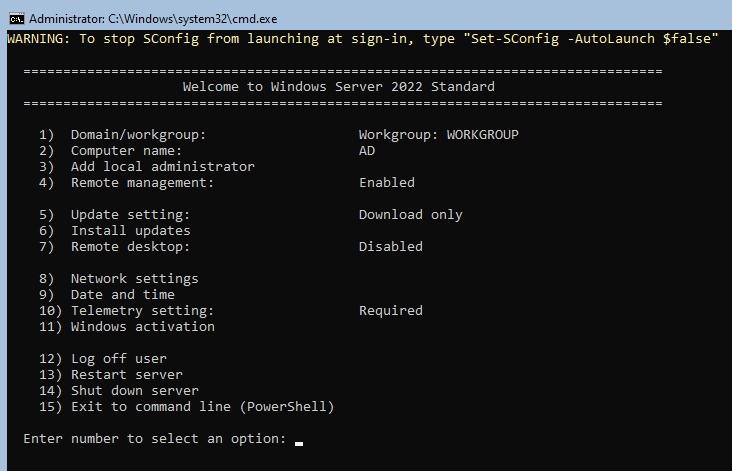

## Test: Worden de files succesvolg getranfered?

Testprocedure:

- Voer het transfer_files.ps1 bestand uit, dit zal via vboxmanage guestcontrol de files versturen naar de WS 2022 in de map: C:\Users\Administrator\Downloads

Verwacht resultaat:

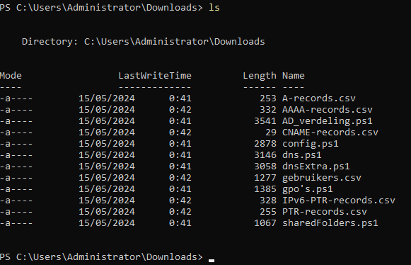

## Test: Is Active Directory Geïnstalleerd?

Test procedure:

- Eerst moet je het config.ps1 script uitvoeren op de Windows Server 2022 en wachten tot de die heropgestart is na het uitvoeren.
- Dan voer je volgend commando uit om te kijken of de Active Directory Domain Services succesvol geïnstalleerd zijn

```powershell
    Get-WindowsFeature -Name AD-Domain-Services
```

Verwacht resultaat: Active Directory - Install State: Installed

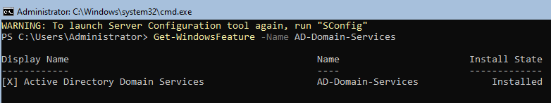

## Test: Is het Active Directory domein succesvol toegevoegd aan de server?

Testprocedure:

- Eerst moet je het config.ps1 script uitvoeren op de Windows Server 2022 en wachten tot de die heropgestart is na het uitvoeren.

Verwacht resultaat:

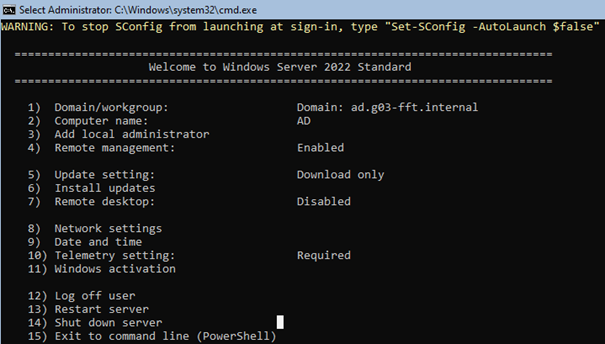

## Test: Is de configuratie juist?

Testprocedure:

- Na het uitvoeren van het config.ps1 script wordt ook de configuratie ingesteld voor IP, DG, DNS. werkt dit?

Verwacht resultaat:

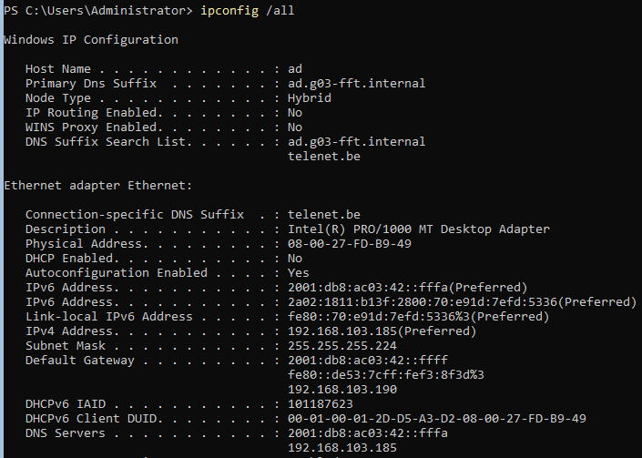

Opmerking: Soms als je de DNS-ServerAddressen instelt via het script is dit weg na het heruitvoeren. Als je na de herinstallatie het dns.ps1 script uitvoert werkt dit wel.

## Test: Is het domein correct?

Testprocedure:

- Test of het domein correct is met volgend commando:

```powershell
    Get-ADDomain
```

Verwacht resultaat:

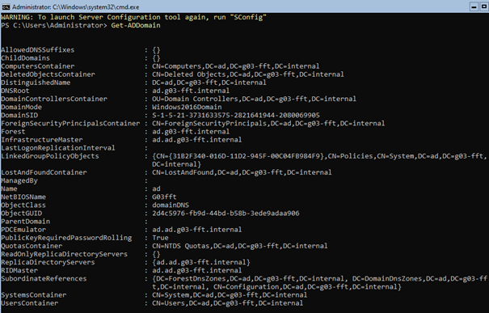

## Test: Worden de domain users correct toegevoegd aan het AD domein?

Testprocedure:

- Voer het script AD_verdeling.ps1 uit en test het met het volgende commando en kijk of de Users zijn toegevoegd uit het gebruikers.csv bestand

```powershell
    Get-ADUser -Filter *
```

Verwacht resultaat:

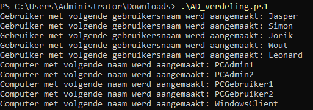
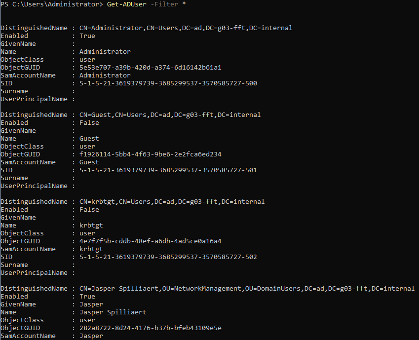
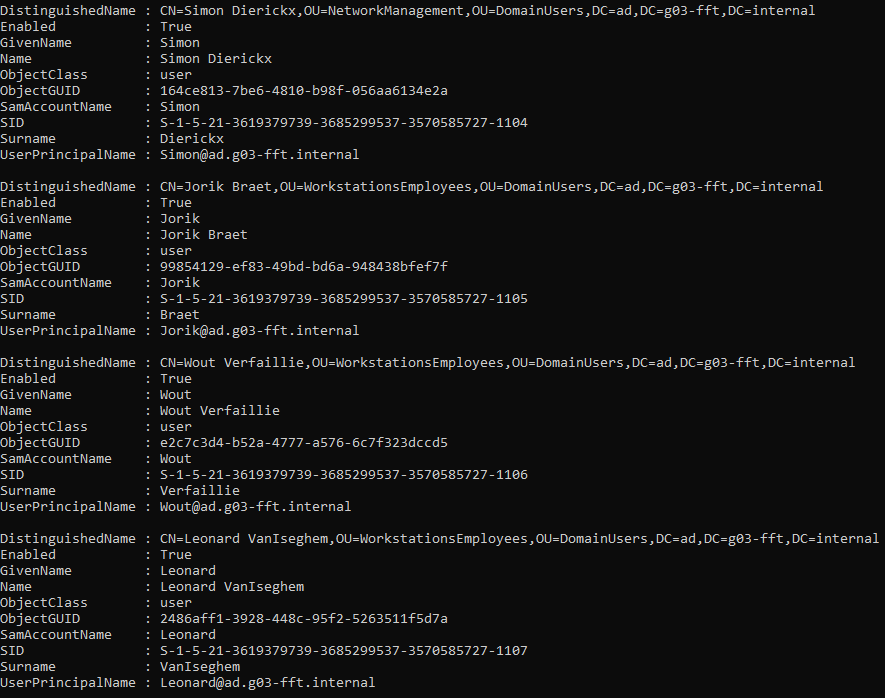


## Test: Werkt de gpo?

Testprocedure:

- Voer het GPO's.ps1 script uit op de Windows Server 2022 om de GPO toe te passen op het AD-Domain.

Verwacht resultaat:

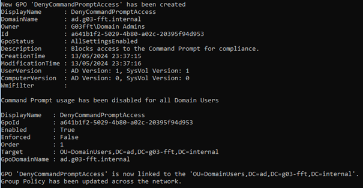
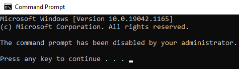
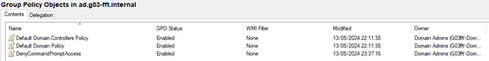

## Test: Heeft een (domain)gebruiker geen rechten op een netwerk share (en domain adrmin wel)?

Testprocedure:

- Voer het sharedFolders.ps1 bestand uit om de netwerkshares toe te passen op de Windows Server 2022.

Verwacht resultaat:

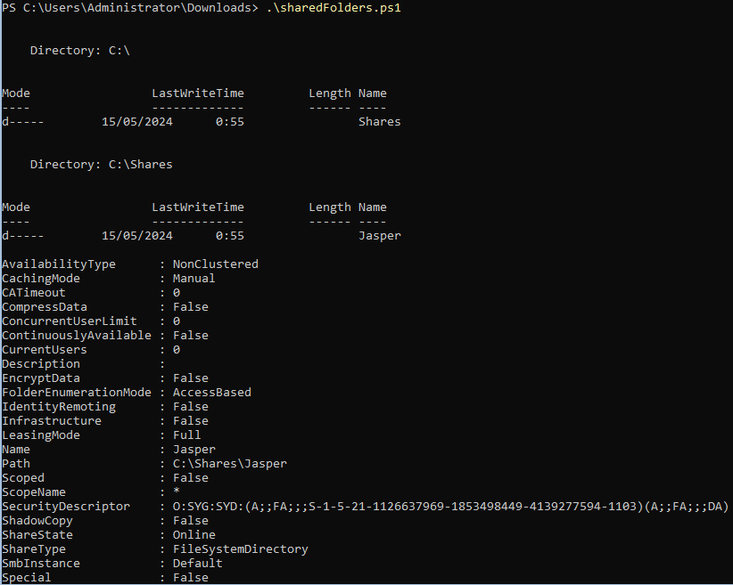
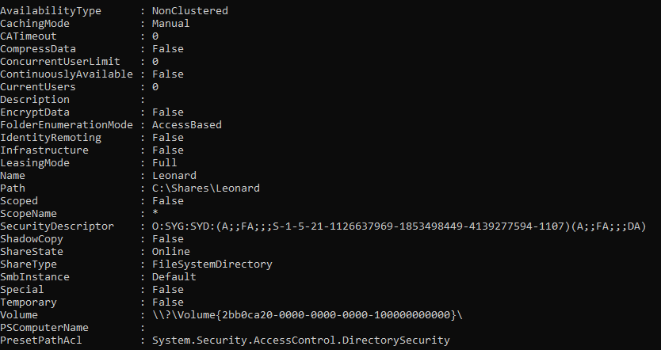

vanop Jasper:
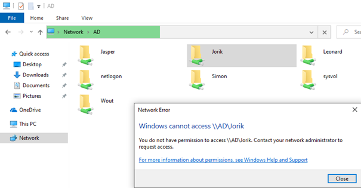
vanop Jasper:
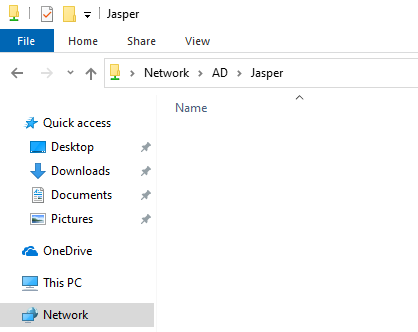
vanop Jasper:
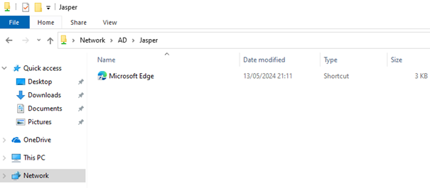
vanop Admin:
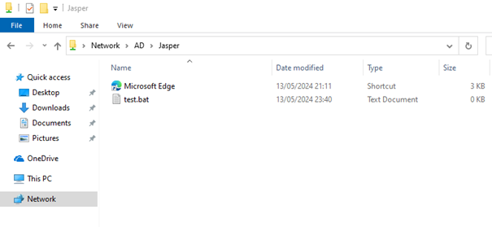

## Test: Werkt de dns.ps1

Testprocedure:

- voer het dns.ps1 bestand uit om alle records te creëren van alle servers (A, AAA, PTR, CNAME).

Verwacht resultaat:

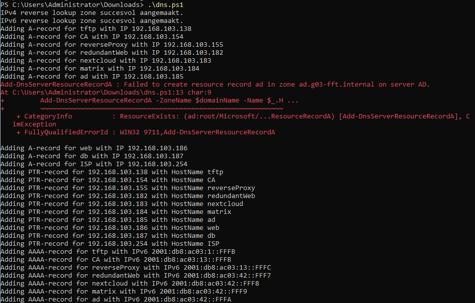
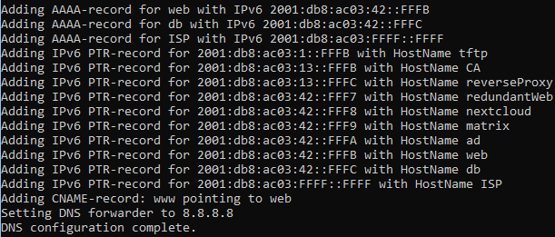

- voer het dnsExtra.ps1 bestand uit voor alle DNS records voor de websites.

Verwacht resultaat:

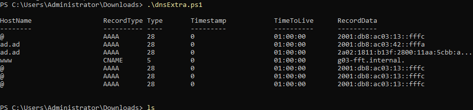
