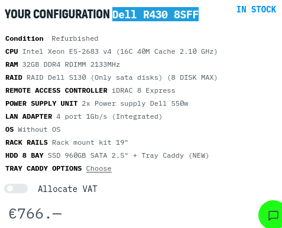
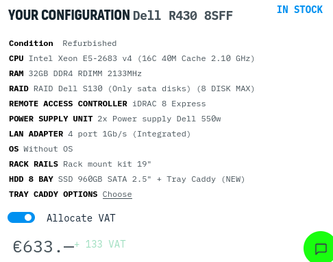

## Apparatuur

| Apparaat                     | Prijs   | Aantal | Totaal  |
| ---------------------------- | ------- | ------ | ------- |
| Router Cisco 1941/K9         | €119,21 | 2      | €238,42 |
| Switch Cisco WS-C2960-24TT-L | €87,79  | 2      | €175,58 |

### 1 serverrack:

https://www.serverkast.com/18u-wandkast-met-glazen-deur-600x600x1000mm.html
24u server rack

### server om vms op te draaien:

https://servermall.com/catalog/servers/server-dell-poweredge-r730xd-24sff/
Server Dell R430 8SFF

https://servermall.com/catalog/servers/server-hpe-dl360-gen9-/
SERVER
HP DL360 GEN9
8SFF

### 1 windows DC server:

https://learn.microsoft.com/en-us/windows-server/administration/performance-tuning/role/active-directory-server/capacity-planning-for-active-directory-domain-services
https://community.spiceworks.com/topic/1982682-ad-hardware-specs-for-500-users

### 1 linux databank servers:

zie vm server

### 1 linux webserver servers:

zie vm server

### 1 linux reverse proxy servers:

zie vm server

### 1 TFTP server

https://community.spiceworks.com/how_to/87667-setting-up-your-local-machine-as-a-tftp-server

### 2 switches:

https://www.routershop.nl/cisco-cbs250-24t-4g/pid=72213

https://www.dustin.be/nl/netwerk-switches/cisco/sf220-24-art-sf220-24-k9-eu-num-2500309/

https://www.dustin.be/nl/netwerk-switches/cisco/catalyst-1000-24-port-ge-4x10g-sfp-art-c1000-24t-4x-l-num-10758084/

### 2 routers:

https://www.router-switch.com/c921-4p.html
https://www.router-switch.com/c931-4p.html
https://www.cisco.com/c/en/us/products/routers/900-series-integrated-services-routers-isr/index.html?ccid=cc001532#~models

https://www.comms-express.com/blog/review-top-5-cisco-routers-for-small-large-businesses/
https://www.secureitstore.com/ISR-1101.asp

### kabels

minimum 7 kabels (doe ik maal 2 voor redundantie dus 14):

https://www.bol.com/be/nl/p/goobay-cat-6-netwerkkabel-s-ftp-grijs-1-5-m/9200000100467925/?bltgh=vp8fxqzOc-JDmubD-chCHQ.nW-WTMUWTPzjdbepJzpBLA_0_4.5.ProductTitle

### kost uren

https://www.serverpronto.com/spu/2019/04/how-much-does-a-server-cost-for-a-small-business/
https://www.vlaanderen.be/statistiek-vlaanderen/arbeid/uren-beroepsarbeid-per-week
https://www.payscale.com/research/BE/Job=Systems_Administrator/Salary
https://www.omnicalculator.com/finance/hourly-to-annual-salary

### ups requirements

| apparaat | watt | aantal | totaal watt |
| -------- | ---- | ------ | ----------- |
| server   | 750  | 2      | 1500        |
| switch   | 10   | 2      | 20          |
| router   | 30   | 2      | 60          |

in totaal 1600 nodig, dus we kijken naar 1600 en daarboven, liefst ook rackmounted voor in de serverkast

https://www.wasserman.eu/en/p/ups-for-rtii-2000va-1800w-rack-cabinet-with-lcd-94972?srsltid=AfmBOopk5xVfYP8uI4fnUT2I_3kV29fmJ8dcXCfflcxMSlZB16CQx_W9bO0

### Internet abbonement

FullFiber Extended
Internet over fiber\* with choice of multi-gig speed

- 1gbps Gbps download and up to 500 Gbps upload
- 1 fixed public IP address and router included
- IJnIimited monthly data volume
- 24/7 technical support
- Repair within 5 working hours

As from €104 /month

### kabel

https://www.amazon.nl/Cisco-USB-consolekabel-Rj45-console-Windows-lichtblauw/dp/B07K1JN1ZC?th=1

### Laptop

https://www.coolblue.be/nl/product/933822/lenovo-ideapad-slim-3-15iah8-83er003emb-azerty.html

### Scherm

https://www.coolblue.be/nl/product/875841/aoc-24b2xhm2.html

### muis en toetsenbord

https://www.coolblue.be/nl/product/171354/logitech-mk120-toetsenbord-en-muis-azerty.html
